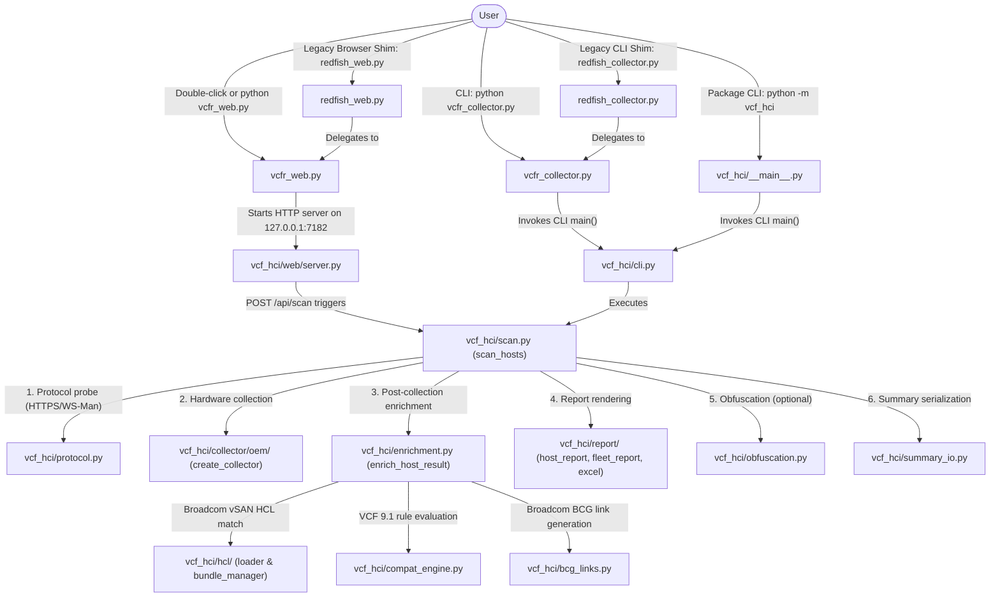
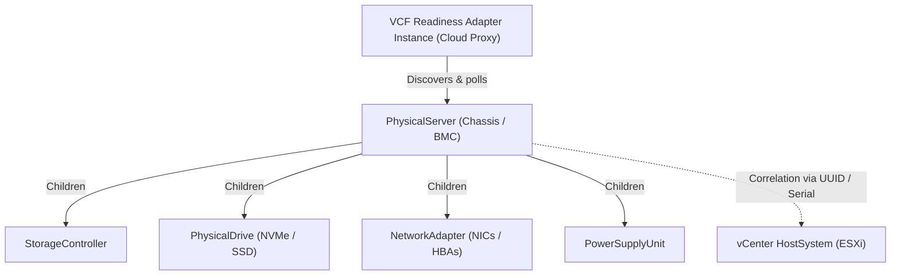

# Architecture Summary & Engineering Handoff

**Project:** VCF / vSphere 9.1 Readiness Assessment Tool  
**Version:** 9.8.0  
**Primary Users:** VMware Sales Engineers (SEs), Solution Architects, IT Administrators  
**Target Platform:** VMware Cloud Foundation 9.1 / vSphere 9.1 / vSAN ESA & OSA

---

## Table of Contents

- [1. System Overview](#1-system-overview)
- [2. Engineering Constraints (Strict Guardrails)](#2-engineering-constraints-strict-guardrails)
- [3. Four-Layer Architecture](#3-four-layer-architecture)
- [4. Package Layout](#4-package-layout)
- [5. Compatibility Logic Reference (Layer B)](#5-compatibility-logic-reference-layer-b)
  - [CPU Evaluation](#cpu-evaluation-vcf9compatibilityengineevaluate_cpu)
  - [vSAN Assessment](#vsan-assessment-vcf9compatibilityengineevaluate_vsan)
  - [Drive Classification](#drive-classification-_parse_drive_details)
- [6. Key Endpoint Map](#6-key-endpoint-map)
- [7. Adding New OEM Adapters](#7-adding-new-oem-adapters)
- [8. Cursor Prompting Tasks](#8-cursor-prompting-tasks)
- [9. Known OEM Quirks](#9-known-oem-quirks)
- [10. Cisco IMC (UCS C-Series) Integration Notes](#10-cisco-imc-ucs-c-series-integration-notes)
- [11. Nutanix BMC Access](#11-nutanix-bmc-access)
- [12. Performance & Scaling Architecture](#12-performance--scaling-architecture)
- [13. Cross-Directory Workspace & Ecosystem Topology](#13-cross-directory-workspace--ecosystem-topology)
- [14. Unified Codebase & Script Connection Catalog](#14-unified-codebase--script-connection-catalog)
- [15. Execution & Release Call Graphs](#15-execution--release-call-graphs)
- [16. Legacy Architecture Notes](#16-legacy-architecture-notes)
- [17. Technical References & Acknowledgements](#17-technical-references--acknowledgements)
- [18. VMware Aria Operations Management Pack Architecture](#18-vmware-aria-operations-management-pack-architecture)

---

## 1. System Overview

The VCF Readiness Assessment Tool is a zero-dependency, multi-threaded Python utility that queries enterprise Out-of-Band Management Controllers (Dell iDRAC, HPE iLO, Supermicro BMC, Cisco IMC, Lenovo XCC, Intel BMC) via Redfish APIs to assess whether existing server infrastructure can be repurposed for VCF 9.1.

### Support depth
- Dell / HPE / Supermicro are production-hardened with dump fixtures (`tests/fixtures/*` plus `samples/` replay dumps).
- Cisco and Lenovo have adapter unit tests, summary fixtures (`test_cisco_c220_fixture.py`, `test_lenovo_sr630_fixture.py`), and replay dumps (`samples/cisco-c220-m5`, `samples/lenovo-sr630v2`). Treat missing optional dumps as skip, not as "fixtures do not exist".
- Intel BMC is registered so Manufacturer `Intel` does not fall through to the wrong OEM. `IntelBMCCollector` is still a `GenericCollector` subclass with only `oem_manager_paths()` filled (`vcf_hci/collector/oem/intel.py`). No successful dump yet; recapture with `tools/redfishMockupCreate.py` is a separate OEM plan.

The primary deliverable is a standalone HTML report per host — no server, no database, no Excel — just a double-click report that an SE can hand to a customer.

---

## 2. Engineering Constraints (Strict Guardrails)

When generating, refactoring, or extending any code in this project:

- **Zero External Runtime Dependencies** — Use ONLY Python 3.9+ standard library for all `vcf_hci/` package code: `urllib`, `ssl`, `json`, `re`, `csv`, `argparse`, `concurrent.futures`, `logging`, `gc`, `ipaddress`. **Never import `requests`, `urllib3`, `pandas`, `jinja2`, or any third-party package.**
- **Dev dependencies** (pytest only) are allowed in `tests/` and are listed in `pyproject.toml` extras.
- **SSL Resilience** — All HTTPS connections must use `ssl.CERT_NONE` to handle self-signed BMC certificates.
- **Defensive JSON Parsing** — All `_get()` calls must trap `json.JSONDecodeError` to handle HTML 404 pages returned by Supermicro embedded web servers (Lighttpd).
- **PyInstaller Compatible** — `pyproject.toml` documents the build commands. Use `--collect-all vcf_hci` in build scripts.
- **Windows Filename Safety** — All filenames derived from hostnames or IPs must be sanitized through `sanitize_filename()` to strip `:*?"<>|/\` characters.
- **Memory Management** — Call `gc.collect()` after each host scan in multi-host runs to prevent memory creep across large subnet scans.
- **Python 3.9 compatibility** — Use `Optional[X]` / `Union[X, Y]` in type hints, not `X | Y`.

---

## 3. Four-Layer Architecture

```
┌────────────────────────────────────────────────────────────────┐
│               Layer A: OEM Redfish Adapter                     │
│  vcf_hci/collector/                                            │
│  ├── base.py          — BaseRedfishCollector ABC               │
│  │   · _get(endpoint) — HTTP Basic Auth, SSL bypass, JSON trap │
│  │   · _discover_roots() — dynamic /Systems, /Chassis, /Managers│
│  │   · OEM hook methods (oem_bios_date, oem_storage_endpoints…)│
│  ├── collect_*.py     — mixin classes per hardware domain      │
│  ├── crawler.py       — Redfish hypermedia crawler (mockup zip)│
│  └── oem/             — vendor subclasses + create_collector() │
└──────────────────────────────┬─────────────────────────────────┘
                               │  Normalized Hardware Payload (dict)
                               ▼
┌────────────────────────────────────────────────────────────────┐
│           Post-Collection Enrichment Pipeline                  │
│  vcf_hci/enrichment.py — enrich_host_result()                  │
│  · Coordinates Layer B compat, Layer C BCG, & Security Audit   │
│  · Evaluates CPU, BIOS, BMC FW, Boot Mode, Topology, Budgets   │
│  · Applies BCG URLs & Drive FW validations in single pass      │
│  · Redacts sensitive credentials & sanitizes PII evidence      │
└──────────────┬───────────────────────┬─────────────────────────┘
               │                       │
               ▼                       ▼
┌─────────────────────────────┐ ┌────────────────────────────────┐
│   Layer B: Compatibility    │ │   BMC Hardware Security Audit  │
│   & Layer C: BCG Links      │ │   vcf_hci/security/            │
│  vcf_hci/compat/ (rules)    │ │   · 84 canonical controls      │
│  vcf_hci/bcg_links.py (BCG) │ │   · Dell/HPE evaluators        │
│  · VCF9CompatibilityEngine  │ │   · Posture scoring & rollup   │
└──────────────┬──────────────┘ └──────────────┬─────────────────┘
               │                               │
               └───────────────┬───────────────┘
                               │  Enriched Verdicts, BCG URLs & Security Posture
                               ▼
┌────────────────────────────────────────────────────────────────┐
│         Layer D: Aggregator, Report, and UI                    │
│  vcf_hci/report/host_report.py  → per-host standalone HTML     │
│  vcf_hci/report/fleet/          → fleet_summary & combined.html│
│  vcf_hci/report/sel_links.py    → vendor SEL deep-link engine  │
│  vcf_hci/report/schema_registry.py → Schema v2.0 domain model  │
│  vcf_hci/report/excel_export.py → 10-tab Excel workbook        │
│  vcf_hci/report/csv_export.py   → standardized domain CSVs     │
│  vcf_hci/summary_io.py          → gzip / v2 manifest / zip I/O │
│  vcf_hci/cli.py                 → argparse + ThreadPoolExecutor│
│  vcf_hci/web/server.py          → browser UI HTTP server (SSE) │
│  vcf_hci/web/app_html.py        → single-page Clarity app      │
└────────────────────────────────────────────────────────────────┘
```

---

## 4. Package Layout & Documentation Map

* **[`AGENTS.md`](AGENTS.md)** — Universal AI agent guardrails and project constraints
* **[`vcf_hci/README.md`](vcf_hci/README.md)** — High-level package entry points and module map

```
vcf_hci/
├── __init__.py           # re-exports every name gui/CLI currently imports
├── __main__.py           # enables `python -m vcf_hci`
├── constants.py          # ESXI_BUILD_TABLE, URL constants, TOOL_VERSION, lookup tables
├── logging_utils.py      # configure_logging, sanitize_filename, parse_ip_targets
├── enrichment.py         # enrich_host_result: post-collection Layer B/C enrichment
├── fleet_library.py      # Multi-scan fleet library crawler, assemble_fleet & manifest I/O
├── fleet_discovery.py    # Two-pass fast discovery & LJF priority scheduling
├── system_throttle.py    # Dynamic system auto-stepdown resource monitor (load avg & RAM)
├── tls_utils.py          # StdlibHTTPConnectionPool (keep-alive pooling) & TLS context setup
├── scan.py               # Multi-host scan coordinator & executor loop
├── scan_host.py          # Single-host scan worker & lifecycle management
├── scan_complete.py      # Post-scan artifact generation (manifests, mockups, reports)
├── summary_io.py         # Gzip / v2 manifest / zip summary I/O
├── code_metadata.py      # Engine version, git commit, and scan lineage tracking
├── bcg_links.py          # BCGLinkGenerator
├── compat_engine.py      # Facade re-exporting VCF9CompatibilityEngine, evaluate_bios_version, etc.
├── compat/               # VCF 9.1 compatibility evaluation domain modules
│   ├── __init__.py       # Package exports
│   ├── npar.py           # evaluate_npar
│   ├── bios_boot.py      # evaluate_boot_mode, evaluate_bios_version, Spectre/CVE
│   ├── firmware.py       # evaluate_bmc_fw_version, evaluate_drive_fw, HCL
│   ├── chassis.py        # _is_oem_chassis_certified
│   ├── pci.py            # evaluate_pci_compatibility, PCIe lane budget
│   ├── cpu.py            # evaluate_cpu, get_cpu_deep_profile
│   ├── vsan.py           # evaluate_vsan
│   ├── memory.py         # evaluate_memory_topology, MemoryInterleavingEngine
│   └── engine.py         # VCF9CompatibilityEngine class
├── protocol.py           # detect_management_protocol, TCP/WS-Man probes
├── wsman.py              # WsManCollector (AMT/DASH)
├── obfuscation.py        # obfuscate_host_data, PII redaction helpers
├── hcl/                  # See vcf_hci/hcl/README.md
│   ├── __init__.py
│   ├── bundle_manager.py # HCLBundleManager, create/import_hcl_bundle
│   ├── loader.py         # load_vsan_hcl_json, load_optional_vsan_csv
│   ├── cross_reference.py # cross_reference_drive, detect_qlc_nvme
│   └── io_nics.json      # Offline Broadcom BCG certified Network I/O catalog
├── bios/
│   ├── __init__.py
│   ├── ras_modes.py      # _detect_memory_ras_modes
│   ├── power_modes.py    # _detect_cpu_power_mode
│   └── security.py       # _detect_side_channel_settings
├── collector/            # See vcf_hci/collector/README.md
│   ├── __init__.py       # factory function + re-exports
│   ├── base.py           # BaseRedfishCollector ABC: _get, run_assessment, rescan
│   ├── crawler.py        # RedfishCrawler: hypermedia tree discovery & mockup export
│   ├── http_session.py   # RedfishSessionManager: session lifecycle & cleanup
│   ├── discovery.py      # DiscoveryMixin: _discover_roots, modular chassis & NIC resolution
│   ├── os_eval.py        # _evaluate_os_info: OS build numbers, lifecycle/EOL status
│   ├── async_helpers.py  # _safe_result, _timed, _h, _SECTION_DEFAULTS
│   ├── collect_system.py # _SystemMixin: collect_system_summary, collect_memory
│   ├── collect_storage.py # _StorageMixin: collect_storage_subsystem
│   ├── collect_storage_drive.py # Drive detail & SMART telemetry parsing
│   ├── collect_network.py # _NetworkMixin: collect_network_adapters, collect_fc_hbas, collect_lldp_neighbors
│   ├── collect_power.py  # _PowerMixin: collect_psu_status, collect_thermal_telemetry
│   ├── collect_logs.py   # _LogsMixin: collect_system_event_log
│   ├── collect_bmc_security.py # BMC security attributes & configuration extraction
│   ├── collect_telemetry.py # _TelemetryMixin: collect_*_telemetry
│   ├── collect_gpu.py    # _GPUMixin: collect_pcie_devices, collect_gpu_accelerators
│   └── oem/
│       ├── __init__.py   # _REGISTRY + create_collector() auto-detect factory
│       ├── generic.py    # GenericCollector (pure DMTF — new OEM starting point)
│       ├── dell.py       # DellCollector (iDRAC OEM fields, BOSS detection)
│       ├── hpe.py        # HPECollector (SmartStorage, iLO ResourceNotReadyRetry)
│       ├── supermicro.py # SupermicroCollector (SimpleStorage, DCMS license gate)
│       ├── cisco.py      # CiscoCollector (CIMC path, serial-number sys URI)
│       ├── lenovo.py     # LenovoCollector (XCC)
│       ├── intel.py      # IntelBMCCollector
│       ├── quanta.py     # QuantaCollector (QCT, Systems/Self fastpath)
│       └── gigabyte.py   # GigabyteCollector (AMI MegaRAC, Systems/Self fastpath)
├── security/             # BMC Hardware Security Audit package (84 canonical controls)
│   ├── __init__.py       # Package exports and public evaluators
│   ├── contract.py       # Neutral finding contract, schema validation, reason codes
│   ├── evaluation.py     # Standard DMTF Redfish security evaluators & dispatcher
│   ├── dell.py           # Dell iDRAC9 OEM configuration evaluators
│   ├── hpe.py            # HPE iLO5/6 OEM configuration evaluators
│   ├── ipmi_probe.py     # Zero-dependency IPMI 2.0 RMCP+ Cipher Suite 0 network probe
│   ├── metadata.py       # Canonical control catalog, groups, titles, confidence
│   ├── redaction.py      # Recursive secret redaction & PII sanitization
│   └── scoring.py        # Host & fleet posture scoring, asset classification
├── report/               # See vcf_hci/report/README.md
│   ├── __init__.py
│   ├── styles.py         # HOST_REPORT_CSS, FLEET_EXTRA_CSS constants
│   ├── components.py     # Reusable HTML building blocks (badge, card, table helpers)
│   ├── host_report.py    # generate_host_html_report()
│   ├── fleet_report.py   # Backward-compatibility facade re-exporting fleet/
│   ├── sel_links.py      # Multi-vendor SEL/IML documentation deep-link resolver
│   ├── schema_registry.py # Schema v2.0 domain field registry and verdict styling
│   ├── inventory_tables.py # build_host_decision_rows, build_inventory_sheets (SE Matrix)
│   ├── switch_topology.py # Switch packet buffer capacity taxonomy, ASIC architecture & leaf pairing
│   ├── excel_export.py   # export_to_excel, build_obfuscated_inventory_zip
│   ├── csv_export.py     # export_all_csvs, generate_fleet_summary_csv
│   └── fleet/            # Fleet report domain modules (tiles, summary, switch_matrix, inventory_panel, combined, vendor)
├── vault/                # OPTIONAL encrypted credential vault (off by default; stdlib-only)
│   ├── __init__.py       # Public exports (CredentialVault, errors, DEFAULT_VAULT_PATH)
│   ├── crypto.py         # PBKDF2-HMAC-SHA256 + HMAC-SHA256 Encrypt-then-MAC primitives (no I/O)
│   ├── store.py          # File format, atomic 0600 writes, exact/CIDR/default resolver
│   ├── csv_io.py         # Credential CSV parser & export template
│   ├── cli.py            # Vault CLI implementation
│   ├── session.py        # Vault session management
│   └── __main__.py       # `python -m vcf_hci.vault` init/add/import-csv/list/remove/resolve
├── web/
│   ├── __init__.py       # package marker
│   ├── server.py         # HTTP engine, routing & public server factory (facade)
│   ├── session_store.py  # Secrets persistence, profile & session state I/O
│   ├── vault_session.py  # Single in-memory unlocked vault for the Web UI, idle auto-lock
│   ├── desktop.py        # Desktop folder picker & native file manager integration
│   ├── scan_worker.py    # Background scan worker, SSE broadcast & fleet regen
│   ├── api_mixin.py      # ApiMixin aggregate HTTP endpoint handlers
│   ├── fleet_api.py      # Fleet library discovery, assembly, and index APIs
│   ├── scan_api.py       # Scan execution & progress endpoints
│   ├── import_api.py     # Summary and scan archive import endpoints
│   ├── export_api.py     # Excel, CSV, and bundle download endpoints
│   ├── security_api.py   # BMC security findings and summary APIs
│   ├── session_api.py    # Session configuration & credential vault endpoints
│   ├── assets.py         # AUTO-GENERATED — bundled Clarity CSS (gzip+base64); never edit by hand
│   ├── app_html.py       # Single-page HTML app template
│   ├── app_css.py        # Web application styles and theme variables
│   ├── app_js.py         # Client-side scan controller, SSE listener, and fleet UI
│   ├── docs_data.py      # AUTO-GENERATED — bundled Markdown docs as HTML dictionary
│   ├── docs_html.py      # Interactive documentation viewer markup
│   ├── docs_css.py       # Documentation viewer styles
│   └── docs_js.py        # Documentation viewer search & navigation logic
└── cli.py                # argparse + scan orchestration — main()

vcfr_collector.py         # Primary CLI entry point
vcfr_web.py               # Primary Browser UI entry point — starts vcf_hci.web.server
redfish_collector.py      # Backward-compatibility CLI shim
redfish_web.py            # Backward-compatibility Browser UI shim

Other Repository Documentation & Directories:
├── samples/              # See samples/README.md (Mock Redfish API catalog & replay map)
├── tests/                # See tests/README.md (Automated test suite & execution guide)
└── tools/                # See tools/README.md (Developer & BMC capture utilities)
```

**Entry points:**

| File | Interface | Notes |
|------|-----------|-------|
| `vcfr_web.py` | Browser UI (recommended) | Opens `http://127.0.0.1:7182`; standard library + browser |
| `vcfr_collector.py` | CLI | `--targets`, `--threads`, `--debug`, etc. |
| `python -m vcf_hci` | CLI (package form) | Same as `vcfr_collector.py` |
| `redfish_web.py` | Browser UI (legacy shim) | Backward-compat shim delegating to `vcfr_web.py` |
| `redfish_collector.py` | CLI (legacy shim) | Backward-compat shim delegating to `vcfr_collector.py` |

**Developer tools (not part of the runtime package):**

| Path | Purpose |
|------|---------|
| `tools/bundle_assets.py` | Fetches latest Clarity CSS and regenerates `vcf_hci/web/assets.py` — requires internet; run once per Clarity upgrade |
| `tools/bundle_docs.py` | Bundles markdown documentation into `vcf_hci/web/docs_data.py` |

---

## 5. Compatibility Logic Reference (Layer B)

### CPU Evaluation (`VCF9CompatibilityEngine.evaluate_cpu`)

| Verdict | CPU Families | BCG Guidance |
|---------|-------------|--------------|
| 🟢 Fully Supported | AMD EPYC 7/8/9xxx, Intel Cascade Lake-SP (2nd Gen), Ice Lake, Sapphire Rapids, Xeon 6 | No action required for CPU |
| 🟡 Supported (Override Required) | Intel Skylake-SP (1st Gen) | Broadcom KB 428874 applies — requires install/upgrade CPU override |
| 🔴 Unsupported | Intel Haswell/Broadwell (v3/v4), pre-Skylake E5 | Cannot run vSphere 9.x |

### vSAN Assessment (`VCF9CompatibilityEngine.evaluate_vsan`)

| Result | Condition |
|--------|-----------|
| 🟢 vSAN ESA Ready | ≥2 direct-attached NVMe SSDs + ≥25 GbE NIC |
| 🟡 ESA Storage Met | ≥2 NVMe drives but max NIC < 25 GbE |
| 🟡 vSAN OSA Eligible | ≥2 SAS/SATA drives |
| 🔴 Not vSAN Eligible | < 2 qualifying drives |

### Drive Classification (`_parse_drive_details`)

| Badge | Condition |
|-------|-----------|
| ⚙️ Boot Device Only | BOSS, NS204i, M.2, AHCI.SLOT, Marvell controllers |
| 🔴 NOT Supported (NVMe Behind RAID) | NVMe/PCIe protocol + RAID controller + has logical volumes |
| 🔵 Memory Tiering Candidate | Optane P4800X/P4801X/P5800X/P1600X models |
| 🟡 vSAN OSA Compatible Only | SAS/SATA protocol, or HDD media type |
| 🟢 vSAN ESA / OSA Compatible | NVMe/PCIe protocol, direct-attached |

---

## 6. Key Endpoint Map

The collector queries these Redfish endpoints per host:

```
/Systems                          → root discovery
/Systems/{id}                     → model, CPU, memory, TPM, BIOS version
/Systems/{id}/Bios                → VMD / NVMe RAID BIOS attributes
/Systems/{id}/Memory              → DIMM inventory and channel topology
/Systems/{id}/Storage             → primary storage controllers + drives
/Systems/{id}/SimpleStorage       → Supermicro storage fallback
/Systems/{id}/SmartStorage/...    → HPE SmartStorage controllers
/Systems/{id}/EthernetInterfaces  → Supermicro LOM NICs
/Systems/{id}/LogServices         → SEL / IML alarms
/Systems/{id}/Accelerators        → GPU / accelerator inventory (where available)
/Chassis/{id}/PCIeDevices         → PCIe device list (GPU detection fallback)
/Chassis/{id}/NetworkAdapters     → NIC inventory + NetworkPorts
/Chassis/{id}/Power               → PSU count, wattage, redundancy
/Chassis/{id}/Thermal             → temperature sensors with thresholds
/Managers/{id}                    → BMC info, license (HPE iLO)
/Managers/{id}/LogServices        → manager-level event log
/TelemetryService/MetricReports/CPUUsage             → CPU utilization history
/TelemetryService/MetricReports/SystemBoardMemoryUsage → memory bus utilization
```

*Scan Mode Note (`quick_mode` vs `lean_mode`):*
- **Quick Scan (`quick_mode=True`):** Skips `/Storage`, `/NetworkInterfaces`, `/NetworkAdapters`, `/Power`, `/Thermal`, `/Accelerators`, and `/TelemetryService` endpoints to complete in ~5s/host instead of ~60–90s. Storage and NIC sections will be empty.
- **Lean Scan (`lean_mode=True`):** Skips telemetry metrics, firmware inventory member GETs, and extra thermal GETs while maintaining full `/Storage`, `/NetworkInterfaces`, and `/NetworkAdapters` inventory queries (~15–30s/host). This captures all Drive and NIC PCI IDs for Broadcom BCG compatibility matching without the overhead of heavy telemetry.

---

## 7. Adding New OEM Adapters

See [`docs/adding-oem-support.md`](docs/adding-oem-support.md) for the full hook API reference. See README BMC coverage table for fixture status.

**Quick summary:** Create one file in `vcf_hci/collector/oem/`, subclass `GenericCollector`, override only the hooks that differ, and add a `VENDOR_MATCH` tuple. Register the class in `_REGISTRY` in `vcf_hci/collector/oem/__init__.py`. No other files need to change.

**OEM Hook Methods Reference:**
- `oem_bios_date(sys_data)` → `str` (BIOS release date)
- `oem_sku(sys_data)` → `str` (part number / SKU)
- `oem_storage_endpoints()` → `list[str]` (extra storage URIs to scan)
- `oem_drive_endurance(drive)` → `float | None` (wear %)
- `oem_drive_metrics(drive)` → `dict` (NVMe SMART telemetry: TBW, TBR, POH, temp, unsafe shutdowns, spare %)
- `oem_cpu_cache(proc_data)` → `list[dict]` (L1/L2/L3 cache detail)
- `oem_memory_usage(sys_data)` → `dict` (`MemoryBusUtilization` etc.)
- `oem_nic_firmware(adapter)` → `str` (NIC FW version)
- `oem_port_transceiver(port_json)` → `dict` (optical transceiver metadata: SFP28/QSFP28/DAC, vendor, PN, SN)
- `oem_gpu_sensors()` → `list[dict]` (GPU sensors: thermal, operating max, slowdown/shutdown thresholds, power brake status)
- `oem_license_info(mgr, sys)` → `dict` (`license_name`, `badge`)
- `oem_handle_retry(data, endpoint)` → `bool` (`True` = retry after 3s)
- `oem_manager_paths()` → `list[str]` (non-standard manager URIs)

---

## 8. Cursor Prompting Tasks

When using Cursor to add features, scope prompts to individual layers:

| Task | Prompt Scope |
|------|-------------|
| Add a new hardware check for all vendors | `collect_*` mixin in `vcf_hci/collector/` |
| Add OEM-specific behavior | `oem/` subclass in `vcf_hci/collector/oem/` |
| Change VCF compatibility rules | `VCF9CompatibilityEngine` in `vcf_hci/compat_engine.py` |
| Add a new BCG category | `BCGLinkGenerator` in `vcf_hci/bcg_links.py` |
| Change HTML report layout | `generate_host_html_report()` in `vcf_hci/report/host_report.py` |
| Change fleet summary | `generate_summary_html()` in `vcf_hci/report/fleet_report.py` |
| Add CLI argument | `main()` in `vcf_hci/cli.py` |
| Add a constant or lookup table | `vcf_hci/constants.py` |

---

## 9. Known OEM Quirks

| Vendor | Known Behavior | Handled By |
|--------|---------------|-----------|
| Supermicro | Returns HTML 404 pages (Lighttpd) instead of Redfish JSON errors | `json.JSONDecodeError` trap in `_get()` |
| Supermicro | Drives under `/SimpleStorage` not `/Storage` | `SupermicroCollector.oem_storage_endpoints()` |
| Supermicro | **`/Storage` blocked by DCMS license** (`OemLicenseNotPassed`) | `_is_license_blocked()` surfaces badge to SE |
| Supermicro | CPU string may be generic `"Intel(R) Xeon(R) processor"` (old firmware) | Cannot detect Xeon D — advise BMC firmware update |
| HPE iLO | Uses `/SmartStorage/ArrayControllers` hierarchy | `HPECollector.oem_storage_endpoints()` |
| HPE iLO | **`ResourceNotReadyRetry`** on NetworkAdapters (BMC scan in progress) | `HPECollector.oem_handle_retry()` → 3s retry |
| HPE iLO | System usage in `Oem.Hpe.SystemUsage` not TelemetryService | `HPECollector.oem_memory_usage()` fallback |
| Dell iDRAC | BIOS release date in `Oem.Dell.DellSystem.BIOSReleaseDate` | `DellCollector.oem_bios_date()` |
| Dell iDRAC | Populates `System.SKU` with Service Tag (e.g. `7SBKS13`) | `DellCollector.oem_sku()` filters out Service Tag from SKU |
| HPE iLO | BIOS date in `Oem.Hpe.Bios.Current.Date` | `HPECollector.oem_bios_date()` |
| Dell iDRAC | NICs/Storage may be empty in pre-boot state (even in full scan mode) | Expected — tool must be run with host powered on and OS active |
| Cisco IMC | Manager at `/Managers/CIMC` not `/Managers/1` | `CiscoCollector.oem_manager_paths()` |
| Cisco IMC | System path is serial number e.g. `/Systems/FCH2005V1EN` | Dynamic root discovery |
| Cisco IMC | SEL is at `/Chassis/1/LogServices/SEL` | Chassis-level fallback in `collect_system_event_log()` |
| Intel BMC | System path uses serial number or `RackMount`; Manager ID varies (`BMC`, `1`) | `IntelBMCCollector.oem_manager_paths()` + dynamic root discovery |
| Quanta / QCT | Systems/Self + `Oem.Quanta_RackScale` (drive telemetry, PartNumber/PowerOnHours) | `QuantaCollector.oem_fastpath_roots()` / `oem_drive_metrics()` |
| GIGABYTE | AMI MegaRAC Self roots + `Oem.GBT` (e.g. `SlotNumber`) | `GigabyteCollector.oem_fastpath_roots()` / `oem_drive_metrics()` |
| All | `/Systems` may have member path like `/Systems/System.Embedded.1` | `_discover_roots()` handles all patterns |

---

## 10. Cisco IMC (UCS C-Series) Integration Notes

Cisco UCS C-Series rack servers use **CIMC (Cisco Integrated Management Controller)**. Key differences from standard DMTF Redfish:

| Endpoint | Cisco Value | Standard Value |
|----------|------------|----------------|
| Manager path | `/Managers/CIMC` | `/Managers/1` |
| System path | `/Systems/{SERIAL_NUMBER}` (e.g. `FCH2005V1EN`) | `/Systems/1` |
| SEL location | `/Chassis/1/LogServices/SEL` | `/Systems/{id}/LogServices/SEL` |
| Manager type | `"CIMC"` | `"BMC"` |

---

## 11. Nutanix BMC Access

Nutanix hardware platforms typically use Supermicro or OEM motherboards with standard BMC interfaces:
- Redfish at: `https://<IPMI_IP>/redfish/v1`
- Same Supermicro quirks apply: DCMS license gate on Storage API, generic CPU strings on older firmware.

---

## 12. Performance & Scaling Architecture

The summary report pipeline supports large fleet scaling (e.g. `/24` subnets with 254+ hosts):

- **Progressive Multi-Pass Auto-Retry & Differential Rescan**: Web UI and scan worker implement automated multi-pass retry (up to 3 total passes: 1 initial scan + up to 2 targeted retry passes). Unresponsive or partial hosts are automatically re-scanned with gentle concurrency (2–4 threads), elevated timeouts (600s), and targeted differential section collection (`rescan_partial_sections()`) to safely recover slow or degraded BMCs without rescanning already complete hosts.
- **Dynamic Phase Timeouts**: Phase 1 and Phase 2 concurrency timeout ceilings in `BaseRedfishCollector` scale dynamically based on the configured `host_timeout` (`min(180s, max(60s, host_timeout * 0.4))` for Phase 1 and `min(300s, max(90s, host_timeout * 0.6))` for Phase 2), eliminating premature section aborts on slow PLDM/I2C buses.
- **Pre-Scan Latency Probing & VPN Auto-Throttling**: Pre-scan TCP handshake RTT latency measurements sample candidate BMCs and dynamically scale fleet thread concurrency down to 8 threads on high-latency WAN/VPN connections (avg RTT > 80ms or max RTT > 150ms).
- **Decoupled Raw Capture**: `--save-json` writes structured summary JSONs without raw API payloads. Raw Redfish HTTP response bodies are included only when `--debug` or `--include-raw` is requested.
- **Adaptive Fleet Hub Embedding (`inline` vs `sidecar`)**:
  - Eliminates the historical 256-host ceiling (`COMBINED_HTML_MAX_HOSTS = 4096` soft limit) that previously dropped combined report generation.
  - **Inline Mode** (&le; 64 hosts): Generates a standalone single-file HTML deliverable with lazy `data-srcdoc` attributes. Hidden host frames are not parsed at load time, conserving browser memory. Embeds full multi-sheet Excel workbook.
  - **Sidecar Mode** (&gt; 64 hosts up to 3,000+ hosts): Automatically transitions to sidecar mode. Sibling reports are loaded from `reports/` via dynamic `data-src` iframes with an LRU cache capping concurrent active iframes to 3. Host navigation replaces static tab buttons with a searchable, filterable host picker dropdown. Sibling `.xlsx` file links replace Base64 embedding.
  - **Capped Static DOM Rows**: For fleets &gt; 500 hosts, initial HTML rendering caps Summary and Detailed Inventory sub-tables to 500 rows, guaranteeing sub-second browser paint, while the full fleet dataset is preserved in the compact `#fleet-inv-data` JSON island.
  - **Scale Benchmark Proof**: 3,000-host synthetic benchmark generates a consolidated Fleet Hub HTML report in ~1.3 seconds at 6.10 MB, well under the 8.0 MB budget.
- **Multi-Scan Fleet Library & Universal Drop Ingest (`vcf_hci/fleet_library.py`)**:
  - Decoupled Collection: Remote edge collectors or worker nodes execute scans locally and drop standardized output folders or zip archives with `MANIFEST.json` into a shared library path (default `~/Desktop/VCF-Scans`) or push via `POST /api/fleet/ingest` (with `/api/v1/fleet/ingest` alias).
  - Discovery (`discover_scans()`): Shallow-smart scan crawler detects timestamped scan folders and zip archives containing `data/fleet_summary.json` or `MANIFEST.json`.
  - Deduplication & Provenance (`assemble_fleet()`): Multi-scan merge resolves host identities using a deterministic fallback hierarchy: Redfish System UUID &rarr; Serial + Model &rarr; BMC IP &rarr; Hostname. The newest `scanned_at` timestamp wins, tracking `previous_scan_ids` provenance.
  - Memory-Managed Working Set: At &gt; 500 hosts, `_state["results"]` is trimmed in memory to prevent RAM exhaustion; `_state["fleet_index"]` maintains a compact ~3–8 MB index in RAM, streaming full payloads from disk on demand.
  - Lazy Host HTML Rendering: Central assemble does not pre-render 3,000 host HTML files; `_serve_report` lazily renders single-host reports on first open and caches them to disk. An optional `/api/fleet/prerender` endpoint allows pre-baking on demand.
- **Summary I/O (`vcf_hci/summary_io.py`)**: Automatic version 2 summary payload handling:
  - Compressed `.json.gz` output when uncompressed size exceeds 1 MiB.
  - Chunked multi-file parts (`prefix_part01.json.gz`) when host count exceeds 100 or uncompressed size exceeds 8 MiB.
  - `load_summary()` transparently loads plain `.json`, `.json.gz`, v2 manifests, directories of summary JSONs, or `.zip` archives.
- **File Stream Import**: Browser UI adds `POST /api/import-summary-file` streaming upload for summary files > 8 MB or compressed `.gz`/`.zip` files to bypass the 10 MB JSON POST limit.
- **Lean Scan Mode**: `--lean` / `lean_mode=True` skips telemetry collectors, firmware inventory member GETs, and ThermalSubsystem per-item GETs while keeping core CPU, BIOS, vSAN, NIC, and storage assessment.

---

## 13. Unified Repository & Workspace Topology

The VCF Readiness tool repository serves as the single source of truth for development, full test suites, hardware sample captures, multi-platform PyInstaller compilation, and offline distribution packaging.

```mermaid
flowchart TD
    subgraph unifiedWorkspace [Unified Workspace: Distribution-Redfish-Scraper]
        webEntry["vcfr_web.py (Primary Browser UI Entry)"]
        cliEntry["vcfr_collector.py (Primary CLI Entry)"]
        shimWeb["redfish_web.py (Legacy Browser UI Shim)"]
        shimCli["redfish_collector.py (Legacy CLI Shim)"]
        pkgCore["vcf_hci/ (Core Package Engine)"]
        devTools["tools/ (bundle_docs, bundle_assets, clean_build_artifacts)"]
        testsDir["tests/ (Pytest Suite & Fixtures - 500+ tests)"]
        docFiles["docs/ & ARCHITECTURE.md"]
        binDir["bin/ (Compiled Executables: .app, .exe, CLI)"]
        distZip["Distribution-VCF-Readiness.zip (Offline Bundle)"]
        vestigialDir["vestigial/ (Archived Legacy Tools, Obsolete Specs, Logs)"]
    end

    buildMac -->|"Compiles via PyInstaller"| webEntry
    buildMac -->|"Generates"| binDir
    buildWin -->|"Compiles on Windows"| binDir
    packScript -->|"Stages & zips bin, docs, tools, hcl"| distZip
    packScript -->|"Pushes git tags & uploads to"| gitHub["GitHub Releases (gh CLI)"]
```



---

## 14. Unified Codebase & Script Connection Catalog

### A. Summary of Classifications
- **Active Runtime**: Core application code required for Web UI, CLI, and report generation.
- **Active Build & Release**: Packaging, build scripts, remote compilation orchestrators.
- **Active Developer Utility**: Tooling for asset generation, documentation bundling, live BMC captures.
- **Active Documentation & Specs**: Core architectural, onboarding, and workflow specifications.
- **Active Test & Fixture**: Pytest test suite, sample BMC captures, mock replays.
- **Data & Cache Assets**: Offline HCL datasets and pre-built bundles (`all.json`, `vcf_hcl_bundle_latest.zip`).
- **Auto-Generated / Generated Output**: Files generated by scripts (must not be edited by hand).
- **Vestigial / Deprecated**: Obsolete files leftover from older architectures (e.g. Tkinter GUI, accidental specs).
- **Separate / Legacy Project**: Utilities from earlier tool iterations (e.g. Memory Tiering Assessor).

---

### B. File-by-File Catalog

#### 1. Entry Points & Core Orchestration (`vcf_hci/`)
| File Path | Status | What It Does | Connected Scripts / Callers |
| :--- | :--- | :--- | :--- |
| `redfish_web.py` | Active Runtime | Backward-compatibility Browser UI shim delegating to `vcfr_web.py`. | Legacy entry point callers. |
| `redfish_collector.py` | Active Runtime | Backward-compatibility CLI shim delegating to `vcfr_collector.py`. | Legacy entry point callers. |
| `vcf_hci/__main__.py` | Active Runtime | Package entry point enabling `python -m vcf_hci`. | Delegates to `vcf_hci.cli.main()`. |
| `vcf_hci/__init__.py` | Active Runtime | Package re-exports for backward compatibility. | Imported by entry points, `server.py`, tests. |
| `vcf_hci/constants.py` | Active Runtime | Lookup tables, ESXi build tables, tool version, and URL constants. | Read by all modules; updated by `bump_version.sh`. |
| `vcf_hci/logging_utils.py` | Active Runtime | Logging configuration, `sanitize_filename()`, and `parse_ip_targets()`. | Used across collectors, reports, web server. |
| `vcf_hci/protocol.py` | Active Runtime | Multi-protocol BMC probe (HTTPS Redfish, WS-Man, AMT/DASH). | Called by `vcf_hci/scan.py` before collector instantiation. |
| `vcf_hci/wsman.py` | Active Runtime | WS-Man / AMT collector for legacy management protocols. | Invoked by `scan.py` if WS-Man protocol is detected. |
| `vcf_hci/scan.py` | Active Runtime | Unified multi-threaded scanning loop (`scan_hosts()`). | Called by `vcf_hci/web/server.py` and `vcf_hci/cli.py`. |
| `vcf_hci/enrichment.py` | Active Runtime | `enrich_host_result()`: Post-collection pipeline applying Layer B compatibility verdicts, memory topology, lane budgets, and Layer C BCG deep links. | Invoked by `scan.py` on collected host payloads. |
| `vcf_hci/compat_engine.py` | Active Runtime | Backward-compatibility facade re-exporting VCF 9.1 rules engine from `vcf_hci/compat/`. | Invoked by `scan.py`, `enrichment.py`, and report renderers. |
| `vcf_hci/compat/` | Active Runtime | Domain modules: CPU support (KB 428874), vSAN ESA/OSA, memory interleaving, TPM, VMD, BIOS/BMC firmware baselines, PCI HCL correlation. | Invoked via `vcf_hci.compat` or `vcf_hci.compat_engine` facade. |
| `vcf_hci/bcg_links.py` | Active Runtime | Generates deep links for Broadcom Compatibility Guide (Servers, CPUs, SSDs, IO, GPUs). | Used by report generators and compatibility engine. |
| `vcf_hci/obfuscation.py` | Active Runtime | SHA-256 salted PII obfuscation for IPs, MACs, S/Ns, and SEL logs. | Invoked by `scan.py` and Web server when obfuscation requested. |
| `vcf_hci/summary_io.py` | Active Runtime | Multi-format summary JSON/gzip reader and writer (`load_summary()`, `write_fleet_summary()`). | Used by CLI `--from-summary` and Web server import endpoints. |
| `vcf_hci/fleet_library.py` | Active Runtime | Multi-scan library crawler, ingest manifest writer, and fleet assembler (`discover_scans()`, `assemble_fleet()`, `write_scan_manifest()`, `read_scan_manifest()`). Deduplicates hosts across multiple scans (newest `scanned_at` wins) with provenance tracking. | Used by CLI (`--from-summary <dir>`, `--site`, `--assemble-only`) and Web UI Fleet API. |
| `vcf_hci/cli.py` | Active Runtime | Argparse CLI handler with ThreadPoolExecutor scan runner. | Called by `vcfr_collector.py`, `redfish_collector.py`, and `python -m vcf_hci`. |

#### 2. Hardware Collectors & OEM Subsystem (`vcf_hci/collector/`)
| File Path | Status | What It Does | Connected Scripts / Callers |
| :--- | :--- | :--- | :--- |
| `vcf_hci/collector/base.py` | Active Runtime | `BaseRedfishCollector` ABC: HTTP Basic Auth, SSL bypass, JSON trap, `run_assessment`, `rescan_partial_sections`, dynamic inner worker sizing (2–5 workers), and adaptive throttling circuit breakers. | Base class for `GenericCollector` and OEM subclasses. |
| `vcf_hci/collector/crawler.py` | Active Runtime | `RedfishCrawler`: Read-only hypermedia tree crawler with cycle detection, mutation action filter, collection capping, and DMTF mockup zip export. | Standalone diagnostic tool & offline dataset generator. |
| `vcf_hci/collector/http_session.py` | Active Runtime | `RedfishSessionManager`: Session lifecycle management, persistent Keep-Alive connection pooling (`StdlibHTTPConnectionPool`) with 1:1 socket alignment, and dynamic inter-request pacing (pipelined zero-pacing 0.0s). | Used by `base.py` and scan loops. |
| `vcf_hci/collector/discovery.py` | Active Runtime | `DiscoveryMixin`: Dynamic URI root discovery, modular chassis detection, BMC silicon classification (`classify_bmc_silicon` across 5 eras), inner worker ceiling sizing (`determine_inner_worker_ceiling`), and product name resolution. | Mixed into `BaseRedfishCollector`. |
| `vcf_hci/collector/os_eval.py` | Active Runtime | `_evaluate_os_info`: OS build numbers, lifecycle/EOL status, and ESXi update badges. | Used by `base.py` assessment and rescan. |
| `vcf_hci/collector/async_helpers.py` | Active Runtime | Asynchronous execution helpers (`_safe_result`, `_timed`, `_h`, `_SECTION_DEFAULTS`). | Used across `base.py` and collector modules. |
| `vcf_hci/collector/collect_system.py` | Active Runtime | `_SystemMixin`: CPU model, core count, memory topology, BIOS version. | Mixed into `BaseRedfishCollector`. |
| `vcf_hci/collector/collect_storage.py` | Active Runtime | `_StorageMixin`: RAID/HBA controllers, physical drives, SMART telemetry parsing. | Mixed into `BaseRedfishCollector`. |
| `vcf_hci/collector/collect_network.py` | Active Runtime | `_NetworkMixin`: NIC adapters, link speeds, Fibre Channel HBAs, multi-vendor LLDP/CDP extraction, and Cisco VIC subordinate port/device function pre-caching. | Mixed into `BaseRedfishCollector`. |
| `vcf_hci/collector/collect_power.py` | Active Runtime | `_PowerMixin`: Power supplies, wattage, redundancy, thermal sensors. | Mixed into `BaseRedfishCollector`. |
| `vcf_hci/collector/collect_logs.py` | Active Runtime | `_LogsMixin`: System Event Log (SEL) and Integrated Management Log (IML) extraction. | Mixed into `BaseRedfishCollector`. |
| `vcf_hci/collector/collect_telemetry.py` | Active Runtime | `_TelemetryMixin`: CPU utilization and memory bus metric reports. | Mixed into `BaseRedfishCollector`. |
| `vcf_hci/collector/collect_gpu.py` | Active Runtime | `_GPUMixin`: NVIDIA/AMD accelerator and PCIe device discovery. | Mixed into `BaseRedfishCollector`. |
| `vcf_hci/collector/pci_utils.py` | Active Runtime | PCI vendor/device ID extraction and database lookups. | Used by storage, network, and GPU mixins. |
| `vcf_hci/collector/oem/__init__.py` | Active Runtime | `create_collector()` auto-detect factory and `_REGISTRY`. | Called by `scan.py` to instantiate appropriate OEM collector. |
| `vcf_hci/collector/oem/generic.py` | Active Runtime | `GenericCollector` DMTF Redfish standard fallback implementation. | Inherited by vendor OEM subclasses. |
| `vcf_hci/collector/oem/dell.py` | Active Runtime | `DellCollector`: iDRAC OEM endpoints, BOSS controller, drive endurance. | Registered in `oem/__init__.py`. |
| `vcf_hci/collector/oem/hpe.py` | Active Runtime | `HPECollector`: SmartStorage, iLO `ResourceNotReadyRetry`, system usage. | Registered in `oem/__init__.py`. |
| `vcf_hci/collector/oem/supermicro.py` | Active Runtime | `SupermicroCollector`: SimpleStorage fallback, DCMS license gate detection. | Registered in `oem/__init__.py`. |
| `vcf_hci/collector/oem/cisco.py` | Active Runtime | `CiscoCollector`: CIMC manager path (`/Managers/CIMC`), chassis SEL. | Registered in `oem/__init__.py`. |
| `vcf_hci/collector/oem/lenovo.py` | Active Runtime | `LenovoCollector`: ThinkSystem XCC drive metrics and license tiers. | Registered in `oem/__init__.py`. |
| `vcf_hci/collector/oem/intel.py` | Active Runtime | `IntelBMCCollector`: Intel server BMC path quirks. | Registered in `oem/__init__.py`. |

#### 3. BMC Hardware Security Audit Subsystem (`vcf_hci/security/`)
| File Path | Status | What It Does | Connected Scripts / Callers |
| :--- | :--- | :--- | :--- |
| `vcf_hci/security/contract.py` | Active Runtime | Neutral finding contract, 84 canonical control IDs, schema validation, reason codes, and evidence helpers. | Used across security evaluators, enrichment, and collectors. |
| `vcf_hci/security/evaluation.py` | Active Runtime | Standard DMTF Redfish security evaluators (SSH, IPMI over LAN, Telnet, SNMP, Session Auth/Timeout, Directory/Lockout, Secure Boot) & vendor dispatcher. | Called by `enrichment.py` during post-collection pipeline. |
| `vcf_hci/security/dell.py` | Active Runtime | Comprehensive Dell iDRAC9 OEM configuration evaluators (cipher suites, user accounts, RACADM, NTP, syslog). | Dispatched by `evaluation.py` for Dell hardware. |
| `vcf_hci/security/hpe.py` | Active Runtime | Comprehensive HPE iLO5/6 OEM configuration evaluators (encryption standards, production security state, SNMP, audit logs). | Dispatched by `evaluation.py` for HPE hardware. |
| `vcf_hci/security/metadata.py` | Active Runtime | Canonical control catalog, control groups (Baseline, Assurance, Operational, Conditional), titles, and confidence levels. | Used by report builders, Web UI, and Excel exporter. |
| `vcf_hci/security/redaction.py` | Active Runtime | Recursive secret redaction, credential sanitization (passwords, tokens, private keys), and PII obfuscation. | Called by `enrichment.py`, `obfuscation.py`, and summary export. |
| `vcf_hci/security/scoring.py` | Active Runtime | Host and fleet security posture scoring (`Baseline Met`, `Action Required`, `Partially Assessed`), asset classification, and fleet rollups. | Used by fleet report tiles, inventory panels, and Web API. |

#### 4. Report Generation Subsystem (`vcf_hci/report/`)
| File Path | Status | What It Does | Connected Scripts / Callers |
| :--- | :--- | :--- | :--- |
| `vcf_hci/report/host_report.py` | Active Runtime | `generate_host_html_report()`: Generates standalone per-host HTML assessment report. | Called by `scan.py` and `server.py`. |
| `vcf_hci/report/fleet_report.py` | Active Runtime | Backward-compatibility facade re-exporting fleet generators from `vcf_hci/report/fleet/`. | Called by `scan.py` and `server.py`. |
| `vcf_hci/report/fleet/` | Active Runtime | Fleet report modular domain generators: `summary.py` (executive dashboard), `tiles.py` (analytics tiles), `switch_matrix.py` (ToR fabric matrix), `combined.py` (tabbed report), `inventory_panel.py` (SE matrix), `vendor.py`, `escape.py`. | Assembled by `fleet_report.py` facade and `scan.py`. |
| `vcf_hci/report/sel_links.py` | Active Runtime | Multi-vendor SEL / IML Guide Links & Event Resolvers (`VENDOR_SEL_GUIDES`, `get_sel_link`, `format_sel_badge`) covering Dell EEMS, HPE IML, Cisco UCS, Lenovo XCC, and Supermicro IPMI. | Used by `health.py` and fleet combined report. |
| `vcf_hci/report/schema_registry.py` | Active Runtime | Extensible Schema Registry (Schema v2.0) defining 40+ typed hardware fields across 11 export domains and verdict color rules. | Used by `excel_export.py` and `csv_export.py`. |
| `vcf_hci/report/inventory_tables.py` | Active Runtime | `build_host_decision_rows()` and `build_inventory_sheets()` producing dense SE decision records and component inventory rows. | Used by `inventory_panel.py` and `excel_export.py`. |
| `vcf_hci/report/excel_export.py` | Active Runtime | Pure standard-library `.xlsx` spreadsheet generator (ZIP+XML) with 10 structured domain tabs. | Called by `scan.py` and `server.py` (`/api/export-excel`). |
| `vcf_hci/report/csv_export.py` | Active Runtime | `export_all_csvs()` and `generate_fleet_summary_csv()` producing standardized multi-domain tabular CSV exports. | Called by `scan.py` and `server.py` (`/api/export-csv`). |
| `vcf_hci/report/components.py` | Active Runtime | Reusable HTML component builders (cards, badges, tables, details). | Used by `host_report.py` and sections. |
| `vcf_hci/report/styles.py` | Active Runtime | CSS design tokens, dark mode variables, and report stylesheets. | Embedded into all generated HTML reports. |
| `vcf_hci/report/helpers.py` | Active Runtime | Formatting helpers, string sanitizers, and status badge helpers. | Used across all report renderers. |
| `vcf_hci/report/sections/*.py` | Active Runtime | Section renderers: `overview.py`, `cpu.py`, `memory.py`, `storage.py`, `network.py`, `pcie_gpu.py`, `bios_security.py`, `health.py`, `firmware_os.py`. | Assembled by `host_report.py`. |

#### 5. Web UI Subsystem (`vcf_hci/web/`)
| File Path | Status | What It Does | Connected Scripts / Callers |
| :--- | :--- | :--- | :--- |
| `vcf_hci/web/server.py` | Active Runtime | `ThreadingHTTPServer`: Core HTTP engine, routing & public server factory (facade). | Started by `redfish_web.py` / `python -m vcf_hci.web`. |
| `vcf_hci/web/session_store.py` | Active Runtime | Secrets persistence (Keychain, DPAPI, secret-tool), profiles & session file I/O. | Imported by `server.py`, `api_mixin.py`. |
| `vcf_hci/web/vault_session.py` | Active Runtime (opt-in) | Holds at most one unlocked `CredentialVault` in server memory under a lock; 60-min idle auto-lock; locked on shutdown. | Imported by `server.py`, `api_mixin.py` (`/api/vault/*`, `use_vault` in `/api/scan`). |
| `vcf_hci/vault/crypto.py` | Active Runtime (opt-in) | Stdlib-only authenticated encryption: PBKDF2-HMAC-SHA256 (600k) key derivation, HMAC-SHA256 counter-mode keystream, HMAC-SHA256 Encrypt-then-MAC with header as AAD. No I/O. | Imported by `vault/store.py`. |
| `vcf_hci/vault/store.py` | Active Runtime (opt-in) | `CredentialVault`: JSON envelope format, atomic `0600` writes (+ Windows `icacls`), exact → longest-CIDR → default resolution, `resolve_for_targets()` producing the `scan_hosts(creds=...)` dict. Never imports `vcf_hci.web`. | Imported by `cli.py` (`--vault`), `vault/__main__.py`, `web/vault_session.py`. |
| `vcf_hci/vault/csv_import.py` | Active Runtime (opt-in) | `parse_credentials_csv()` — header aliases, BOM, comments, per-line errors, duplicate warnings. | Imported by `vault/__main__.py`, `web/api_mixin.py`. |
| `vcf_hci/vault/__main__.py` | CLI Entry Point | `python -m vcf_hci.vault` management commands (`init`, `add`, `import-csv`, `list`, `remove`, `resolve`, `change-passphrase`, `template`). | Invoked by operators. |
| `vcf_hci/web/desktop.py` | Active Runtime | Native desktop folder chooser dialog and desktop file launcher. | Imported by `server.py`, `api_mixin.py`. |
| `vcf_hci/web/scan_worker.py` | Active Runtime | Background multi-threaded scan worker, SSE broadcast & fleet artifact regeneration. | Imported by `server.py`, `api_mixin.py`. |
| `vcf_hci/web/fleet_api.py` | Active Runtime | Fleet library API mixin (`FleetApiMixin`): `/api/fleet/discover`, `/api/fleet/assemble`, paginated `/api/fleet/index`, `/api/fleet/ingest`, `/api/fleet/prerender`. | Mixed into `ApiMixin` / `server.py`. |
| `vcf_hci/web/api_mixin.py` | Active Runtime | `ApiMixin` containing JSON and SSE HTTP API handlers mixed into `AppHandler`. | Mixed into `AppHandler` in `server.py`. |
| `vcf_hci/web/app_html.py` | Active Runtime | Single-page Clarity HTML application layout and client-side JavaScript. | Served by `server.py` at `GET /`. |
| `vcf_hci/web/assets.py` | Auto-Generated | Bundled Clarity CSS stylesheet (gzip+base64). Never edit manually. | Generated by `tools/bundle_assets.py`; served by `server.py`. |
| `vcf_hci/web/docs_data.py` | Auto-Generated | Bundled Markdown docs as HTML dictionary. Never edit manually. | Generated by `tools/bundle_docs.py`; served by `docs_html.py`. |
| `vcf_hci/web/docs_html.py` | Active Runtime | Clarity-styled interactive documentation viewer. | Served by `server.py` at `GET /docs`. |

#### 6. Sub-Packages (`vcf_hci/bios/`, `vcf_hci/hcl/`, `vcf_hci/servicetag/`)
| File Path | Status | What It Does | Connected Scripts / Callers |
| :--- | :--- | :--- | :--- |
| `vcf_hci/bios/*.py` | Active Runtime | Evaluates memory RAS modes (`ras_modes.py`), CPU power profiles (`power_modes.py`), and side-channel security (`security.py`). | Called by `BaseRedfishCollector` during scan. |
| `vcf_hci/hcl/loader.py` | Active Runtime | Loads online/cached `all.json` or offline Broadcom vSAN HCL CSVs. | Called by `scan.py` during initialization. |
| `vcf_hci/hcl/bundle_manager.py` | Active Runtime | Manages dark-site offline HCL bundles (`vcf_hcl_bundle_*.zip`). | Called by CLI `--bundle-hcl` / `--import-hcl`. |
| `vcf_hci/hcl/cross_reference.py`| Active Runtime | Matches NVMe/SAS/SATA drive models and PCI IDs against Broadcom vSAN HCL. | Used across storage evaluation, enrichment, and report rendering. |
| `vcf_hci/servicetag/dell_api.py` | Active Runtime | Dell TechDirect OAuth2 API client for warranty & factory specs lookup. | Called by `scan.py` when credentials provided. |
| `vcf_hci/servicetag/esa_evaluator.py` | Active Runtime | Evaluates ESA readiness from factory component manifest. | Used with `dell_api.py`. |

#### 7. Documentation & Technical Specs (`docs/` & Root)
| File Path | Status | What It Does | Connected Scripts / Callers |
| :--- | :--- | :--- | :--- |
| `README.md` | Active Documentation | Comprehensive user guide, quickstart, and feature catalog. | Bundled by `bundle_docs.py` into Web UI docs. |
| `ARCHITECTURE.md` | Active Technical Spec | Four-layer architecture, module map, and engineering handoff. | Bundled by `bundle_docs.py` into Web UI docs. |
| `docs/INSTALL.md` | Active Documentation | Multi-platform zero-dependency installation guide. | Bundled by `bundle_docs.py` into Web UI docs. |
| `docs/OEM_REFERENCE.md` | Active Technical Spec | Baseline tables, chassis bay mappings, and OEM quirk guide. | Bundled by `bundle_docs.py` into Web UI docs. |
| `docs/adding-oem-support.md` | Active Developer Spec | OEM hook extension API and onboarding guide. | Bundled by `bundle_docs.py` into Web UI docs. |
| `00_HOWTOLAUNCH.TXT` | Active User Guide | Quick text launch instructions bundled in release archives. | Included in release zip. |

#### 8. Developer Tools (`tools/`)
| File Path | Status | What It Does | Connected Scripts / Callers |
| :--- | :--- | :--- | :--- |
| `tools/bundle_assets.py` | Active Dev Utility | Downloads Clarity CSS from CDN, compresses with gzip, and writes `vcf_hci/web/assets.py`. | Run manually when updating Clarity tokens. |
| `tools/redfishMockupCreate.py` | Active Dev Utility | DMTF crawler to generate mock server directories. | Upstream tool for Redfish mockups. |
| `tools/sync_io_hcl.py` | Active Dev Utility | Queries Broadcom BCG compguide API for ESXi 9.1/9.0 certified I/O adapters, driver recommendations, and firmware baselines; generates `vcf_hci/hcl/io_nics.json`. | Standalone offline catalog updater. |
| `tools/check_data_hygiene.py` | Active Dev Utility | Mechanical pre-commit / CI gate verifying zero corporate/lab internal hostname and IP leakage; validates fictitious `rainpole.io`/`rainpole.net` domains. | CI check and pre-release gate. |
| `tools/build_fleet_optimization_comparison_report.py` | Active Dev Utility | Generates comparative benchmark HTML reports evaluating scan speeds across concurrency/caching optimization levels. | Performance regression analysis. |
| `tools/build_lean_comparison_report.py` | Active Dev Utility | Compares summary JSON sizes and query durations between standard and `--lean` scan modes. | Telemetry overhead profiling. |
| `tools/anonymize_captured_mockups.py` | Active Dev Utility | Recursively sanitizes serial numbers, MAC addresses, IPs, and asset tags from captured Redfish mockup trees. | Offline mock preparation. |
| `tools/crawl_oem_host.py` | Active Dev Utility | Live hypermedia Redfish crawler exporting DMTF-compliant mockup trees with cycle detection and mutation filtering. | BMC scrape utility. |
| `tools/export_vcommunity_drop.py` | Active Dev Utility | Packages clean community-facing source drop with internal paths and sensitive references scrubbed. | Community release distribution. |
| `tools/build_lenovo_cisco_dumps.py` | Active Dev Utility | Synthesizes and normalizes Redfish mock dumps for Lenovo XCC and Cisco IMC UCS rack servers. | Test fixture generator. |
| `tools/build_user_guide.py` | Active Dev Utility | Compiles segmented markdown chapters in `docs/user_guide/` into unified documentation. | User guide build script. |
| `tools/generate_infographic_html.py` | Active Dev Utility | Generates interactive standalone presentation infographic and customer-facing slide deck. | Post-release presentation artifact generator. |
| `tools/ingest_public_mockups.py` | Active Dev Utility | Downloads and stages public DMTF mockups for replay testing. | Test suite fixture staging. |

#### 9. Build Scripts & Packaging (`Distribution-Redfish-Scraper` & Root)
| File Path | Status | What It Does | Connected Scripts / Callers |
| :--- | :--- | :--- | :--- |

#### 10. Data & Cache Assets
| File Path | Location | Status | Purpose & Usage |
| :--- | :--- | :--- | :--- |
| `all.json` | Root of both repos | **Active Data Cache** | ~20.2 MB cached Broadcom vSAN HCL database used when offline. |
| `vcf_hcl_bundle_latest.zip` | Root & `hcl/` | **Active Offline Bundle** | ~611 KB pre-packaged offline HCL dataset bundle. |
| `vcf_hci/hcl/io_nics.json` | `vcf_hci/hcl/` | **Active Offline Catalog** | ~1.4 MB Broadcom BCG certified Network I/O adapter catalog matching PCI IDs to ESXi 9.1/9.0 drivers and firmware baselines. |
| `hcl/vSAN SSD_*.csv` | `hcl/` | **Active Offline Fallback** | Fallback CSV of vSAN SSD compatibility. |
| `hcl/CPU Series_*.csv` | `hcl/` | **Active Offline Fallback** | Fallback CSV of CPU generation support tiers. |

---

## 15. Execution & Release Call Graphs

### A. Runtime Execution Flow


### B. Build & Release Pipeline


---

## 16. Legacy Architecture Notes

The project has transitioned from legacy single-script and desktop GUI approaches to a modular, zero-dependency architecture with a web browser UI (`vcfr_web.py`) and standard CLI (`vcfr_collector.py`). All legacy shims (`redfish_collector.py`, `redfish_web.py`) remain fully backward-compatible.

---

## 17. Technical References & Acknowledgements

- **Broadcom Compatibility Guide (BCG)**: [https://compatibilityguide.broadcom.com/](https://compatibilityguide.broadcom.com/)
- **Michael Buraglio's Packet Buffer Reference**: [https://port-buffers.forwardingplane.net/](https://port-buffers.forwardingplane.net/) ([GitHub: buraglio/port-buffers](https://github.com/buraglio/port-buffers)) — Switch packet buffer sizes, queue architectures, and silicon specifications catalog.
- **Jim Warner's UCSC Packet Buffer Research**: [https://people.ucsc.edu/~warner/buffer-wuz.html](https://people.ucsc.edu/~warner/buffer-wuz.html) ([ASIC Buffer History](https://people.ucsc.edu/~warner/Bufs/buf-hist.html)) — Switch ASIC buffer depths, memory segmentation, and shared memory research.
- **Clarity Design System**: [https://clarity.design/](https://clarity.design/) (VMware/Broadcom, Apache-2.0).

---

## 18. VMware Aria Operations Management Pack Architecture (Experimental)


### A. Architecture & Resource Hierarchy


### B. Core Characteristics
- **Direct Multi-Vendor Redfish Collection**: Communicates out-of-band directly with Dell iDRAC (8/9), HPE iLO (4/5/6), Supermicro BMC, Cisco IMC, and Lenovo XCC without intermediary gateways (e.g. Dell OMEVV or HPE OneView).
- **Two-Tier Polling Model**:
  1. *Daily Deep Inventory & Readiness Scan (24h TTL)*: Evaluates CPUs, DIMMs, storage controllers, NVMe pass-through, NICs, BIOS/TPM, and VCF 9.1 compatibility rules, emitting static properties without database churn.
  2. *Lightweight Health Rollup (Intermediate Ticks)*: Fast 1-call chassis health probe (`Status.Health`, ~200ms) to detect hardware component failures without re-traversing the full BMC hierarchy.


