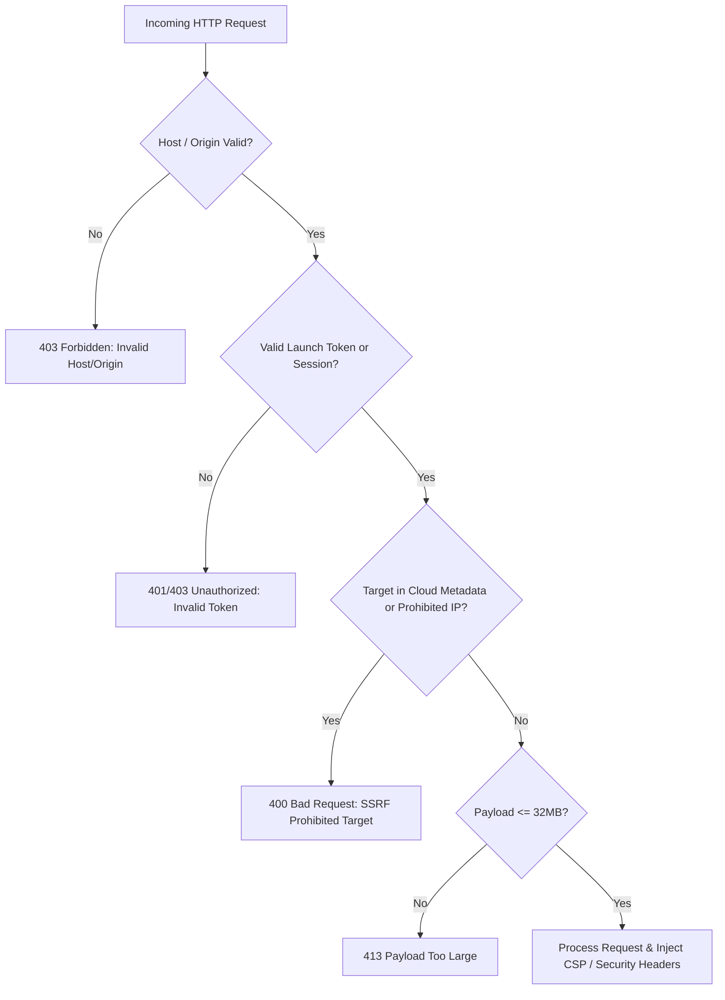

# Security Architecture Whitepaper
## VCF / vSphere 9.1 HCI Readiness Assessment Tool (`vcf_hci`)

> **Target Audience:** Information Security (InfoSec), Cybersecurity Architecture, Compliance, and Security Operations (SOC) teams evaluating authorization for execution in enterprise datacenter environments.

---

## 1. Executive Summary: Why Security Teams Approve This Tool

The **VCF / vSphere 9.1 HCI Readiness Assessment Tool** is a non-intrusive, read-only hardware auditor designed to evaluate enterprise server compatibility against VMware Cloud Foundation (VCF) 9.1 and vSAN Express Storage Architecture (ESA) standards.

From an Information Security and Cyber Risk perspective, the tool is engineered with a strict minimal-attack-surface philosophy:

1. **Zero Hypervisor / OS Footprint:** Requires **no** host agents, kernel modules, OS daemons, or in-band credentials. It operates entirely out-of-band (OOB).
2. **Principle of Least Privilege:** Connects strictly via **read-only** Baseboard Management Controller (BMC) accounts over standard HTTPS (port 443). Zero write, reboot, firmware flashing, or configuration mutation actions are performed.
3. **100% Python Standard Library (Zero Third-Party Dependencies):** Package code uses **only** built-in Python 3.9+ modules (`urllib.request`, `ssl`, `json`, `hashlib`). No unvetted third-party `pip` packages (e.g., `requests`, `aiohttp`, `jinja2`) are bundled or imported, eliminating supply-chain attack vectors.
4. **Complete Source Auditability (No Opaque Binaries Required):** While convenience executables are published, the tool can be inspected and run purely as plain-text Python source code (`python3 vcfr_web.py` or `python3 -m vcf_hci`).
5. **Zero Egress / No "Phone-Home":** The tool contains **no** analytics beacons, crash telemetry, license validation check-ins, or background egress channels. All compatibility evaluations and report generation occur 100% locally.
6. **Air-Gap / Dark-Site Support:** Operates seamlessly in isolated air-gapped networks. Public Broadcom Hardware Compatibility List (HCL) datasets can be packaged offline (`--bundle-hcl`) and imported (`--import-hcl`), eliminating any need for dual-homed management workstations.
7. **Deterministic Data Obfuscation:** Built-in cryptographic PII sanitization hashes IPs, MACs, serial numbers, hostnames, and WWNs with a random salt while preserving essential hardware and topology relationships for external review.
8. **Hardened Local Web UI:** Web UI server binds strictly to `127.0.0.1`, validates cryptographic launch tokens and session tokens, enforces strict Host/Origin headers to prevent DNS rebinding, and blocks SSRF access to cloud metadata endpoints.
9. **Permissive Code & LLM Audit Rights:** The software license explicitly grants organizations full rights to inspect, audit, SAST-scan, or feed the source code into AI/LLM security analysis platforms (e.g., Mythos, Fable, CodeQL, SonarQube).

---

## 2. Architecture & Data Flow

```
┌──────────────────────────────────────────────────────────────────────────┐
│              OPERATOR WORKSTATION / BASTION HOST                         │
│                                                                          │
│   ┌──────────────────────────────────────────────────────────────────┐   │
│   │  Local Web UI (127.0.0.1:7182) or CLI (vcfr_collector.py)        │   │
│   │  • Bound to localhost loopback only                              │   │
│   │  • Protected by CSRF & high-entropy launch token                 │   │
│   │  • SSRF filtering blocks cloud metadata endpoints                │   │
│   └────────────────────────────────┬─────────────────────────────────┘   │
│                                    │                                     │
│   ┌────────────────────────────────▼─────────────────────────────────┐   │
│   │  Python 3.9+ Standard Library Runtime Engine                     │   │
│   │  • urllib.request / ssl / json / hashlib / concurrent.futures    │   │
│   │  • ZERO external pip dependencies / zero native shared libs      │   │
│   └─────────────────┬───────────────────────────────▲────────────────┘   │
│                     │                               │                    │
│                     │ (Read-Only JSON Scans)        │ (Offline Import)   │
│                     ▼                               │                    │
│   ┌──────────────────────────────────┐  ┌───────────┴────────────────┐   │
│   │ Standalone HTML Reports          │  │ Offline HCL Zip Bundle     │   │
│   │ (Standard & Obfuscated PII-Free) │  │ (vcf_hcl_bundle_*.zip)     │   │
│   └──────────────────────────────────┘  └────────────────────────────┘   │
└───────────────────────┬──────────────────────────────────────────────────┘
                        │
                        │ Out-of-Band Network (HTTPS / 443 Only)
                        │ DMTF Redfish / WS-Man [GET / Enumerate Only]
                        │ TLS Verification or TOFU SHA-256 Thumbprint Pinning
                        │
                        ▼
┌──────────────────────────────────────────────────────────────────────────┐
│               ISOLATED MANAGEMENT NETWORK (OOB BMCs)                     │
│                                                                          │
│   ┌───────────────────────┐  ┌───────────────────────┐  ┌────────────┐   │
│   │ Dell iDRAC9 / iDRAC8  │  │ HPE iLO 5 / iLO 6     │  │ Lenovo XCC │   │
│   │ (Read-Only Account)   │  │ (Read-Only Account)   │  │ (Read-Only)│   │
│   └───────────────────────┘  └───────────────────────┘  └────────────┘   │
│   ┌───────────────────────┐  ┌───────────────────────┐  ┌────────────┐   │
│   │ Supermicro BMC        │  │ Cisco IMC (M5 / M6)   │  │ Intel BMC  │   │
│   │ (Operator / Read-Only)│  │ (Read-Only Account)   │  │ (Read-Only)│   │
│   └───────────────────────┘  └───────────────────────┘  └────────────┘   │
└──────────────────────────────────────────────────────────────────────────┘
```

---

## 3. Principle of Least Privilege: Credentials & Access

The assessment tool requires access only to the Out-of-Band management plane and functions completely with unprivileged, read-only credentials.

### Access Boundaries & Privilege Matrix

| Dimension | Tool Requirement | Security Impact / Boundary |
|---|---|---|
| **Network Path** | Out-of-Band (OOB) BMC IP network over HTTPS (TCP 443) | No route to production VM traffic or internal application networks is required. |
| **In-Band / Host Access** | **None** | No ESXi, Windows, or Linux OS credentials; no SSH access to hypervisors; no host-level agents or daemons. |
| **BMC Account Role** | **Read-Only / Operator** | Zero administrative privileges required (no "Administrator" or "Configure" rights needed). |
| **Allowed HTTP Verbs** | `GET`, `OPTIONS`, `HEAD` | Only non-state-changing read methods are executed. Session teardown issues a `DELETE` against the ephemeral `/redfish/v1/SessionService/Sessions/<id>` token. |
| **Prohibited Actions** | `POST` / `PATCH` / `PUT` on system configs | **Zero** power state changes, **zero** reboot commands, **zero** firmware updates, **zero** BIOS configuration modifications. |

### Recommended BMC Role Configuration by Vendor

- **Dell iDRAC:** Assign the default `ReadOnly` role (or custom role with `Login` privilege only).
- **HPE iLO:** Assign a user account with `Login` privilege only. Ensure `Configure iLO Settings`, `Administer User Accounts`, and `Virtual Power and Reset` are **unchecked**.
- **Lenovo XCC:** Assign `Read-Only` or `Supervisor` with all write/remote control privileges disabled.
- **Cisco IMC:** Assign the `read-only` role.
- **Supermicro BMC:** Assign `Operator` or `User` role.

### 3.3 Optional Encrypted Local Credential Vault (opt-in, off by default)

Fleets with several server generations frequently use different BMC passwords per rack or cluster. To avoid plaintext credential CSV files lingering on operator workstations, the tool ships an **optional** encrypted local vault (`vcf_hci/vault/`). It is **never** used unless the operator explicitly opts in (`python -m vcf_hci.vault init`, `vcfr_collector.py --vault`, or the Web UI *Encrypted Credential Vault* card). All pre-existing credential paths (`--username` / `--password-env`, environment variables, Web UI per-host inputs, OS-keychain-backed profiles) are unchanged.

**What it protects against / what it does not**

| Threat | Protected? | Notes |
|---|---|---|
| Vault file copied, backed up, or exfiltrated at rest | **Yes** | Ciphertext only; brute force is gated by a 600,000-iteration PBKDF2 |
| Other local OS users reading the file | **Yes** | File `0600`, directory `0700`; Windows `icacls` owner-only ACL |
| Plaintext credential CSVs left on disk | **Yes** | Import once, then delete the CSV (the tool reminds you) |
| Passwords transiting the browser during a Web UI scan | **Yes** | With *Use vault* enabled, credentials are resolved **server-side**; the browser never receives them |
| Malware running as the same user *while the vault is unlocked* | **No** | Same boundary as any local secret store; auto-locks after 60 min idle and on shutdown |
| Forgotten passphrase | **No recovery** | Delete the vault file and re-create it |
| Secrets lingering in process memory | **Best effort** | Python cannot reliably zero memory; `lock()` drops references |

**Cryptographic construction (`vcf_hci/vault/crypto.py`)**

The vault features progressive enhancement across two cryptographic operating modes:

1. **Hardware-Accelerated AES-256-GCM (Preferred):** When the optional `pycryptodomex` library is present (installable via `pip install "vcf-readiness[crypto]"` or `pip install pycryptodomex`, or bundled in single-file binary distributions), new vaults default to standard NIST **AES-256-GCM** using CPU hardware acceleration (AES-NI). Nonces are 12 random bytes from `secrets.token_bytes`, and the 16-byte authentication tag is verified in constant time prior to decryption.
2. **Pure Standard-Library Fallback (Zero-Dependency):** When running from pure source on bare bastion or air-gapped hosts without external wheels, the vault uses an OpenSSL-backed Encrypt-then-MAC construction built exclusively from Python stdlib primitives (`hashlib`, `hmac`, `secrets`):

| Step | Primitive | Parameters |
|---|---|---|
| Key derivation | PBKDF2-HMAC-SHA256 (`hashlib.pbkdf2_hmac`) | 600,000 iterations, 16-byte random salt, 32-byte master key; iteration floor of 100,000 is enforced on read |
| Sub-key separation | HMAC-SHA256(master, label) | Distinct labels for the encryption key and the MAC key |
| Confidentiality | HMAC-SHA256 counter-mode keystream XOR plaintext | Fresh 16-byte random nonce (`secrets.token_bytes`) on every save |
| Integrity / authenticity | HMAC-SHA256 over `header ‖ nonce ‖ ciphertext` | Verified with `hmac.compare_digest` **before** any decryption; the canonical JSON header (format, version, KDF parameters, cipher id) is bound as associated data so lowering the iteration count or swapping the salt is detected |

In both modes, the canonical JSON header (format, version, KDF parameters, cipher ID) is bound into the authentication tag as Additional Authenticated Data (AAD), ensuring any header tampering (such as lowering iteration counts or swapping the cipher ID) causes immediate verification failure. A wrong passphrase and a tampered file are indistinguishable by design.

**Storage and hygiene**

- Location: `~/.vcf-readiness/credentials.vault` (override with `--vault PATH`). Written atomically (temp file + `os.replace`) with `0600` permissions; on Windows an `icacls /inheritance:r /grant:r <user>:(R,W)` ACL is applied.
- Contents: JSON envelope with base64 fields — no plaintext usernames, passwords, hostnames, or notes are ever on disk.
- Passphrases and BMC passwords are never accepted on the command line (`argv` is visible to other processes); they are read via `getpass` or from an environment variable you name (`--vault-passphrase-env`, `--password-env`).
- `list` / `GET /api/vault/entries` return targets, kinds, usernames, and notes — **never passwords**. There is deliberately no "reveal" or "export plaintext" command.
- Resolution precedence at scan time: exact host → longest-prefix CIDR → `default`. The resolved map is passed directly to the scanner and dropped (`lock()`) when the scan ends.

---

## 3.4 Ephemeral remote execution and jump hosts (Experimental)

> **Preview / Experimental Status:** Ephemeral remote execution via jump hosts is an experimental capability provided for preview testing in isolated or network-segmented environments.

A remote scan is still started from the workstation UI on `127.0.0.1`. The workstation opens SSH to a Linux jump host and runs a short-lived copy of the collector.

- The jump host process is unprivileged. It writes only under `/tmp/vcfr_remote_<hex>` with mode `0700`.
- BMC passwords are sent on the collector's stdin (`--creds-stdin`). They are not placed in argv and not written into the remote directory.
- An embedded SSH private key has to be a file because OpenSSH reads `IdentityFile` from disk. The workstation writes it as mode `0600` in a private temp directory and deletes that directory when the SSH session ends. A key path such as `~/.ssh/id_ed25519` is not copied into the vault.
- Remote deletion runs a small Python program that rejects every path except the sandbox pattern, resolves symlinks with `realpath`, and reads `.vcfr_marker` before `rmtree`.
- Jump-host profiles, including any stored private key, sit in the same PBKDF2-HMAC-SHA256 vault as BMC passwords.
- `--allow-remote` (binding the web server beyond localhost) still disables the vault. Remote *execution* requires the opposite: a localhost UI and an unlocked vault.

## 4. Source Code Auditability & Zero Black-Box Risk

Security teams often restrict pre-compiled binaries due to opacity and potential code injection risks. The tool addresses this directly:

### Running from Pure Python Source
You do not need to execute compiled binaries (`.exe` or macOS `.app`). The tool is distributed as plain-text Python source code that can be verified and executed using any standard Python 3.9+ interpreter:

```bash
# Verify Python version (stdlib only)
python3 --version

# Launch the hardened Web UI directly from source
python3 vcfr_web.py

# Or execute a CLI scan directly from source
python3 vcfr_collector.py --targets 192.0.2.10-192.0.2.20 --user readonly_audit --output-dir ./audit_reports
```

### Zero External Package Dependencies
Unlike typical Python utilities, `vcf_hci` imports **zero external pip packages**. Runtime package code uses exclusively Python standard library modules:

```python
# Permitted Runtime Imports (Enforced via static analysis & CI lint gates)
import argparse, base64, concurrent.futures, csv, gc, glob, hashlib
import html, ipaddress, json, logging, os, re, secrets, socket, ssl
import sys, threading, time, urllib.parse, urllib.request, zipfile
```

**Banned Packages:** `requests`, `urllib3`, `aiohttp`, `pandas`, `jinja2`, `beautifulsoup4`, `lxml`, `cryptography`, `paramiko`.

*Security Benefit:* Eliminates vulnerabilities stemming from dependency tree bloat, malicious upstream package takeovers, dependency confusion attacks, and opaque native C-extension libraries.

---

## 5. Network Egress, Telemetry & Air-Gapped Operation

### Zero "Phone-Home" Guarantee
- **No External Communication:** The tool does not transmit telemetry, analytics, health pings, usage metrics, or license status to Broadcom, VMware, or any third party.
- **Self-Contained Evaluation:** All compatibility rules (CPU generation matrices, vSAN ESA certification logic, BIOS security benchmarks) are embedded directly in the local source code (`vcf_hci/compat/` and `vcf_hci/constants.py`).
- **No Remote Code Execution / No Dynamic Scripts:** Reports are generated as self-contained static HTML files with inline CSS and client-side JavaScript. No external CDNs, fonts, or tracking pixels are referenced.

### Air-Gapped / Dark-Site Operation (Isolated OOB Networks)
To prevent security concerns where an operator device would require simultaneous access to the public internet and an isolated OOB BMC network (dual-homing), the tool provides an offline database bundling workflow:

```
[ Step 1: Internet-Connected Workstation ]
$ python3 -m vcf_hci --bundle-hcl
  └─► Auto-downloads public Broadcom vSAN HCL datasets (all.json)
  └─► Packages into standalone encrypted/checksummed 'vcf_hcl_bundle_YYYYMMDD.zip'

[ Step 2: Transfer via Approved Secure File Ingestion (USB / Bastion) ]

[ Step 3: Air-Gapped Bastion Workstation on OOB Network ]
$ python3 -m vcf_hci --targets 192.0.2.10-20 --import-hcl vcf_hcl_bundle_YYYYMMDD.zip
  └─► 100% offline evaluation against certified hardware database
  └─► Zero internet connectivity required
```

---

## 6. Data Obfuscation & PII Protection

When assessment reports must be shared with external Solution Architects or Broadcom engineering teams, the tool provides a comprehensive automated obfuscation engine (`--obfuscate` flag or in-app toggle).

### Redacted vs. Preserved Attributes

| Data Category | Raw / Standard Report | Obfuscated Report (`--obfuscate`) | Obfuscation Mechanism |
|---|---|---|---|
| **IP Addresses** | `10.0.0.45` | `192.0.2.114` | Mapped to RFC 5737 `192.0.2.x` documentation block via deterministic hash. |
| **Hostnames / FQDNs** | `esx-blade01.rainpole.net` | `Host-1` / `Host-1.example.com` | Replaced by generic sequential aliases and sanitized domain. |
| **System Serials & Asset Tags** | `CN-0ABC12-12345` | `SN-D04C1E`, `TAG-8A91F0` | SHA-256 salted hash token with prefix. |
| **Component Serials** | DIMM, Drive, GPU, NIC serials | `SN-B812DE`, `PN-77A1C0` | SHA-256 salted token replacing hardware serial numbers. |
| **MAC Addresses** | `00:50:56:AB:CD:EF` | `02:D4:E8:11:A3:99` | Converted to IEEE 802 locally-administered MAC format (`02:` prefix). |
| **Storage WWNs / WWPNs** | `50:06:0b:00:00:c2:62:46` | `50:D1:4A:88:E2:0F:7B:1C` | Hashed 8-byte colon-separated synthetic token. |
| **SEL Logs & Check Notes** | Raw message strings | Scrubbed text | Regex scan replaces IPs, MACs, hostnames, and serials in log bodies. |
| **Hardware Architecture** | Intel Xeon 6248, 768GB RAM | **Preserved intact** | Retained to verify VCF 9.1 CPU microarchitecture & ESA readiness. |
| **Drive & Controller Models** | Samsung PM1733, Dell HBA330 | **Preserved intact** | Retained to match against Broadcom vSAN certified HCL entries. |
| **Firmware Versions & BIOS** | BIOS 2.14.0, iDRAC 6.10.30 | **Preserved intact** | Retained to evaluate security CVE mitigation and driver alignment. |

### Cryptographic Salt & Topology Integrity
- **Per-Execution Random Salt:** A high-entropy 128-bit salt (`os.urandom(16)`) is generated for each obfuscated run.
- **Relational Consistency:** The same real identifier within a scan batch produces the identical token across all host reports (e.g., two servers connected to the same switch port receive identical masked switch IDs `SW-A3F9B2`), preserving cluster and network switch matrix topology analysis without revealing physical infrastructure details.
- **Interactive DOM Masking:** HTML reports feature a client-side PII mask toggle allowing live presentations where real hostnames and IPs can be masked or unmasked dynamically in the browser without re-rendering.
- **Sample Reports Available:** Pre-generated sample reports (`samples/` and offline demo files) are provided so security auditors can review the exact data schema and redaction results before running assessments.

---

## 7. Local Web Server Hardening Specification

When running the interactive Browser UI (`vcfr_web.py`), the internal HTTP server (`vcf_hci.web.server`) implements enterprise-grade application security controls:



1. **Loopback-Only Socket Binding:** Binds strictly to `127.0.0.1` (IPv4 loopback) by default. It does not bind to `0.0.0.0` or external NIC interfaces. Remote access is disabled by default.
2. **Cryptographic Launch Token Authentication:** At startup, the server generates a cryptographically secure 128-bit random token (`secrets.token_hex(16)`). The browser opens with this token in the query string (`http://127.0.0.1:7182/?token=...`), which sets an authenticated `vcf_session` cookie (`SameSite=Strict; HttpOnly`). Requests lacking a valid token receive `401 Unauthorized`.
3. **Anti-CSRF & DNS-Rebinding Defense:** Request validation inspects `Host`, `Origin`, and `Referer` headers. Host headers that do not match `127.0.0.1` or `localhost` are rejected with `403 Forbidden`, neutralizing cross-origin attacks from malicious websites visited in the operator's browser.
4. **Security Response Headers:** Every HTTP response includes:
   - `Content-Security-Policy: default-src 'self' 'unsafe-inline' data:; connect-src 'self';`
   - `X-Frame-Options: SAMEORIGIN`
   - `Cache-Control: no-store`
5. **SSRF Target Protection:** The target parser strictly validates scanning targets and blocks Server-Side Request Forgery attempts aimed at cloud metadata endpoints (`169.254.169.254`, `169.254.170.2`, `fd00:ec2::254`, `metadata.google.internal`).
6. **DoS Mitigation:** Enforces a 32MB maximum request body size cap (`MAX_BODY_SIZE`) to prevent memory exhaustion attacks.
7. **Credential Vault Endpoints (`/api/vault/*`, opt-in):** `status`, `create`, `unlock`, `lock`, `entries` (list / upsert), `remove`, `import-csv`, `coverage`. Every one of them:
   - requires the launch-token session **and** passes the same-origin check (`Sec-Fetch-Site` / `Origin` port) used by the OS-keychain endpoints;
   - is refused with `403` whenever the server was started with `--allow-remote` (the vault is a local-workstation feature only);
   - never returns a password in any response body — entry listings and coverage previews are password-free;
   - answers `423 Locked` when no vault is unlocked, `401` on a wrong passphrase (with a 0.5 s delay on top of the PBKDF2 cost), and `409` if a create would overwrite an existing vault.
   At most one vault is held unlocked in server memory (`vcf_hci/web/vault_session.py`); it auto-locks after 60 minutes idle and on `/api/shutdown` or Ctrl-C. When a scan is submitted with `use_vault: true`, credentials are resolved on the server; the browser-supplied username/password become only a fallback for targets with no vault match. `use_vault` defaults to `false` and the UI checkbox is disabled until a vault is unlocked.

---

## 8. TLS / SSL Security & Certificate Trust Models

Because enterprise BMCs frequently utilize self-signed certificates or private enterprise PKI, the tool supports three granular TLS trust modes:

```
                       ┌──────────────────────────────────────────────────┐
                       │           TLS Configuration Options              │
                       └────────────────────────┬─────────────────────────┘
                                                │
         ┌──────────────────────────────────────┼──────────────────────────────────────┐
         ▼                                      ▼                                      ▼
┌─────────────────────────────┐   ┌─────────────────────────────┐   ┌─────────────────────────────┐
│ 1. Default (Tolerant)       │   │ 2. Strict Enterprise CA     │   │ 3. TOFU Thumbprint Pinning  │
│ • ssl.CERT_NONE             │   │ • --verify-ssl              │   │ • Inspect cert SHA-256      │
│ • Handles self-signed BMCs  │   │ • --ca-bundle <corp-ca.pem> │   │ • PinnedHTTPSConnection     │
│ • TLS 1.2/1.3 encrypted     │   │ • Strict PKI chain checking │   │ • Aborts on thumbprint delta│
└─────────────────────────────┘   └─────────────────────────────┘   └─────────────────────────────┘
```

1. **Default Mode (Lab & Factory BMCs):** Establishes encrypted TLS connections using `ssl.CERT_NONE` to prevent scan interruption on unmanaged, factory-default self-signed BMC certificates.
2. **Strict Enterprise PKI Mode:** Passing `--verify-ssl` and `--ca-bundle /path/to/corporate-ca.pem` forces strict X.509 certificate path validation against your internal Root and Intermediate Certificate Authorities.
3. **Trust-On-First-Use (TOFU) & SHA-256 Thumbprint Pinning:**
   - The UI and CLI can inspect remote server certificates prior to scanning (`inspect_server_certificate`), extracting the Subject CN, Issuer CN, validity window, and SHA-256 fingerprint.
   - Using `PinnedHTTPSConnection`, the tool verifies the presented DER certificate hash against pinned thumbprints. Any certificate change or man-in-the-middle condition immediately aborts the connection.

---

## 9. License Permissions & AI / LLM Security Auditing Rights

Security organizations require clear legal authorization to audit third-party scripts and ingest them into automated scanning engines.

### Software License Terms (`LICENSE.md`)
The tool is licensed under a permissive, royalty-free software license agreement granting worldwide rights to use, copy, inspect, modify, and distribute the software:

> *"You are hereby granted a non-exclusive, worldwide, royalty-free license under CA, Inc.'s copyrights to use, copy, modify, and distribute this software in source code or binary form..."*

### Explicit Audit & LLM Ingestion Rights
Under this license, your security, risk, and engineering teams have full legal authorization to:

1. **Static Analysis & SAST Scanning:** Ingest all repository source files into commercial SAST tools (e.g., Veracode, Checkmarx, SonarQube, Snyk, CodeQL, Semgrep).
2. **AI / LLM Code Audit Platforms:** Upload and process the scripts through internal or cloud-based Large Language Models and AI code reviewers (e.g., Mythos, Fable, internal GitHub Copilot, Anthropic Claude, OpenAI ChatGPT) for line-by-line vulnerability assessment, logic validation, and security compliance verification.
3. **Dynamic Protocol Auditing:** Capture and inspect all outbound HTTP traffic via local web proxies (e.g., OWASP ZAP, Burp Suite, Wireshark) during execution.

---

## 10. Security Evaluation Checklist

This checklist is provided for InfoSec risk assessors completing internal architecture reviews:

| Security Question | Architecture Finding | Evidence / Reference |
|---|---|---|
| **Does the tool install agents on OS/hypervisors?** | **No.** Operates purely via Out-of-Band BMC network. | `vcf_hci/collector/` |
| **Are administrator write privileges required?** | **No.** Standard read-only BMC accounts are used. | [Section 3](#3-principle-of-least-privilege-credentials--access) |
| **Does the software execute binary code that cannot be inspected?** | **No.** Plain Python 3.9+ source is fully auditable. | `vcfr_web.py`, `vcf_hci/` |
| **Does the tool introduce external supply-chain dependencies?** | **No.** Zero third-party `pip` dependencies (stdlib only). | `pyproject.toml`, `vcf_hci/` |
| **Does the tool transmit customer data outside the company?** | **No.** Zero telemetry, zero analytics, zero external network calls. | [Section 5](#5-network-egress-telemetry--air-gapped-operation) |
| **Can the tool function in an air-gapped network?** | **Yes.** Supports offline dark-site HCL zip bundles. | `vcf_hci/hcl/bundle_manager.py` |
| **Can sensitive identifiers be redacted before sharing reports?** | **Yes.** SHA-256 deterministic salted PII hashing engine. | `vcf_hci/obfuscation.py` |
| **Is the local web UI protected against CSRF and DNS rebinding?** | **Yes.** Bound to loopback, launch token auth, strict host headers. | `vcf_hci/web/server.py` |
| **Can enterprise CA certificates and TLS pinning be enforced?** | **Yes.** `--verify-ssl`, `--ca-bundle`, and TOFU thumbprint pinning. | `vcf_hci/tls_utils.py` |
| **How are per-host BMC passwords stored if the operator opts in?** | **Encrypted, off by default.** PBKDF2-HMAC-SHA256 (600k) + AES-256-GCM (with optional pycryptodomex) or stdlib HMAC-SHA256-EtM, `0600` file, no plaintext export, disabled under `--allow-remote`. | [Section 3.3](#33-optional-encrypted-local-credential-vault-opt-in-off-by-default), `vcf_hci/vault/` |
| **Does the audit align with federal CISA/NSA BMC hardening guidance?** | **Yes.** Directly evaluates controls aligned with CISA/NSA *Harden Baseboard Management Controllers* (CSI). | [Section 12](#12-regulatory--hardening-compliance-baselines-cisa-nsa-nist-vcf-scg) |
| **Is the organization permitted to run SAST and LLM code audits?** | **Yes.** Permissive worldwide royalty-free license grant. | `LICENSE.md` |

---

## 11. Recommended Execution Procedure for Security Teams

To execute the assessment under maximum security controls:

1. **Create Read-Only Credentials:** Provision temporary `ReadOnly` accounts on target BMCs with no configuration or reboot permissions.
2. **Inspect the Python Source:** (Optional) Run `git clone`, inspect the codebase, and verify runtime dependencies using your internal SAST/LLM tools.
3. **Run on an Isolated Workstation:** Execute from an operator workstation or bastion host connected to the OOB management network:
   ```bash
   python3 vcfr_collector.py \
       --targets 192.0.2.10-192.0.2.30 \
       --user sec_audit_user \
       --obfuscate \
       --output-dir ./vcf_assessment_results
   ```
4. **Review & Revoke:** Inspect the resulting standalone HTML reports in `./vcf_assessment_results/`, then deactivate the temporary BMC audit credentials.

---

## 12. Regulatory & Hardening Compliance Baselines (CISA, NSA, NIST, VCF SCG)

The out-of-band management controller audit engine evaluates server hardware against an 84-control security catalog anchored in authoritative federal cybersecurity standards, virtualization hardening benchmarks, and open industry specifications.

### 12.1 Regulatory & Standards Alignment

1. **CISA & NSA Joint Guidance (Federal Baseline):**
   - **Guidance:** [CISA/NSA Cybersecurity Information Sheet: Harden Baseboard Management Controllers (PDF)](https://media.defense.gov/2023/Jun/14/2003241405/-1/-1/0/CSI_HARDEN_BMCS.PDF)
   - **Alignment:** Directly assesses all 8 recommendations including credential protection (default passwords, account lockout), network segmentation (management VLAN, dedicated NIC), configuration lockdown (TLS 1.2+, IPMI/Telnet disablement, boundary escape mitigations), routine firmware updates, hardware silicon root of trust verification, and fleet discovery.
2. **VMware Cloud Foundation Security Configuration Guide (SCG 9.1):**
   - **Guidance:** [VCF Security and Compliance Guidelines](https://github.com/vmware/vcf-security-and-compliance-guidelines)
   - **Alignment:** Evaluates 84 canonical controls establishing compliance baselines across cryptographic protocol requirements, service minimization, and credential management. Mapped against upstream ESXi hardware management controls (`esx-9.hardware-management-security`, `esx-9.hardware-ports`, `esx-9.hardware-virtual-nic`, `esx-9.hardware-management-log-forwarding`).
3. **NIST SP 800-193 (Platform Firmware Resiliency):**
   - **Alignment:** Validates hardware silicon root of trust (RoT) anchoring immutable boot integrity (Dell RoT, HPE Silicon Root of Trust) and cryptographically signed firmware components.
4. **DMTF Redfish Standard (DSP0266 & DSP2059):**
   - **Alignment:** Uses open standard schema models (`/redfish/v1/Managers/.../NetworkProtocol`, `AccountService`, `CertificateService`) for vendor-neutral querying and verification.

---

### 12.2 Control Catalog Provenance & Architectural Lineage

Users and auditors frequently inquire about the provenance and numbering of the `C01`–`C59` controls. The catalog structure was established through a formal normalization and alignment process:

1. **Origin of the C01–C59 Taxonomy (Dell iDRAC9 Normalization):**
   - When the BMC security audit engine was designed, Dell was the only server OEM with an exhaustive, setting-by-setting published hardening manual: the *Dell iDRAC9 Security Configuration Guide* (revision A01).
   - This guide was normalized into an audit catalog of 84 canonical controls:
     - **`C01`–`C59` (59 Configuration Controls):** Audited BMC and BIOS configuration settings spanning web, TLS, certificates, SSH, network isolation, service exposure, credentials, directory services, and system lockdown.
     - **`O01`–`O16` (16 Operational Recommendations):** Procedural lifecycle controls (firmware currency, external vulnerability scanning, incident response, credential rotation).
     - **`I01`–`I09` (9 Platform Assurance Capabilities):** Hardware-anchored silicon trust checks, secure boot attestation, and factory component supply-chain verification.
2. **Vendor-Neutral Governance:**
   - While the numbering originates from Dell's comprehensive guide, the **security intent** of the controls is governed by vendor-neutral standards: CISA/NSA's 8 defensive pillars, VMware Cloud Foundation SCG 9.1 hardening directives, and NIST SP 800-193.
   - Out of the 59 configuration controls, **36 controls** represent universal baseline hardening practices applicable to any enterprise virtualization deployment.

---

### 12.3 Three-Tier Multi-OEM Portability Architecture

To audit heterogeneous server environments (Dell PowerEdge, HPE ProLiant, Lenovo ThinkSystem, Cisco UCS, Supermicro, Intel) without forcing proprietary Dell settings onto other platforms, the engine implements a strict three-tier portability model:

```
┌─────────────────────────────────────────────────────────────────────────┐
│                     84 CANONICAL CONTROLS                               │
│         (59 Configuration C01-C59, 16 Operational, 9 Assurance)         │
└────────────────────────────────────┬────────────────────────────────────┘
                                     │
         ┌───────────────────────────┼───────────────────────────┐
         ▼                           ▼                           ▼
┌──────────────────┐       ┌──────────────────┐        ┌──────────────────┐
│  Tier 1: 8 DMTF  │       │ Tier 2: 40 OEM-  │        │ Tier 3: 11 Dell- │
│ Universal Stds   │       │ Neutral Concepts │        │ Specific Controls│
│ (Standard RF)    │       │ (OEM Adapters)   │        │ (Held N/A)       │
└──────────────────┘       └──────────────────┘        └──────────────────┘
```

1. **Tier 1: Universal DMTF Redfish Controls (8 Controls)**
   - **Controls:** `C09` (SSH exposure), `C21` (IPMI-over-LAN), `C23` (Telnet disabled), `C24` (SNMPv3), `C29` (Redfish session auth), `C37` (least-privilege roles), `C43` (central directory), `C53` (UEFI Secure Boot).
   - **Behavior:** Implemented purely via standard DMTF Redfish schemas (`ManagerNetworkProtocol`, `AccountService`, `CertificateService`, `SecureBoot`). Evaluated identically across **all** vendors, including platforms without custom OEM adapters such as Intel Server Systems and Supermicro.

2. **Tier 2: OEM-Neutral Concepts with Per-OEM Adapters (40 Controls)**
   - **Controls:** `C01`–`C08`, `C10`–`C17`, `C20`, `C22`, `C25`–`C28`, `C33`–`C36`, `C38`–`C42`, `C44`–`C47`, `C49`–`C52`, `C54`.
   - **Behavior:** Represent portable security outcomes (e.g. minimum TLS version, syslog over TLS, account lockout threshold, source IP blocking, authenticated NTP) where the underlying API attributes differ by OEM.
   - **Resolution:** Evaluated via vendor-specific telemetry adapters:
     - *Dell iDRAC9:* Evaluated via `DellAttributes` (e.g. `WebServer.1.TLSProtocol`, `SysLog.1.securesyslogenable`).
     - *HPE iLO 5/6:* Evaluated via HPE OEM `SecurityService` (e.g. `SecurityState: HighSecurity/FIPS/CNSA`, `DisableWeakCiphers`).
     - *Lenovo XCC:* Evaluated via Lenovo XCC Security Mode and OneCLI attributes.
     - *Cisco CIMC:* Evaluated via Cisco standalone management attributes.

3. **Tier 3: Dell-Specific Controls (11 Controls)**
   - **Controls:** `C18` (Auto-discovery), `C19` (Auto Config/SCP), `C30` (SEKM workflow), `C31`–`C32` (Group Manager), `C48` (Dell System Lockdown), `C55` (LCD control panel), `C56` (BIOS Live Scanning), `C57`–`C58` (Lifecycle Controller import/export), `C59` (Dell Field Service Debug).
   - **Behavior:** These controls reflect Dell-proprietary architectures or workflows. On HPE, Lenovo, Cisco, Supermicro, and Intel platforms, these 11 controls are strictly evaluated as **`not_applicable`** rather than failing or remaining unknown.

4. **OEM Feature Gap Stubs (`G-*`):**
   - High-value security capabilities unique to other OEMs (e.g. HPE iLO `SecurityState` / `TFA`, Cisco `CNSA` / `SUDI`, Lenovo `System Guard`) are tracked in the architecture as dedicated gap stubs (`G-HPE-*`, `G-CISCO-*`, `G-LEN-*`) to maintain strict separation without corrupting the canonical `C01`–`C59` baseline.
